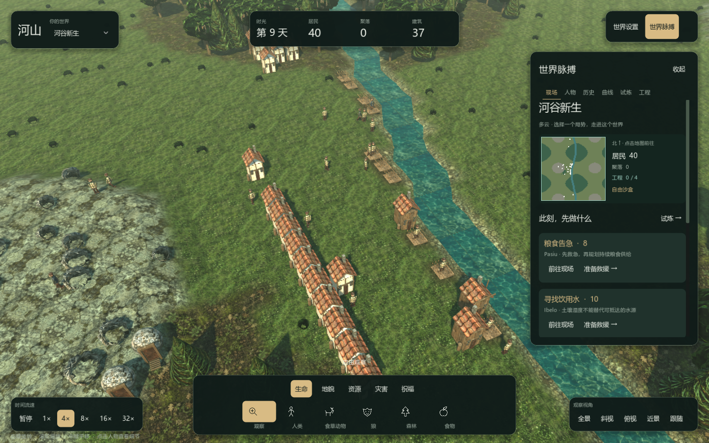

# SandBoxSim · 河山
一个 Godot 4 + C# 沙盒模拟开发版：玩家创造地形、资源和气候条件，居民自主生存、建造、迁移，形成聚落和故事。

## 当前可玩内容
2026-10-05 的迭代将默认界面改为“世界脉搏”：实际地形小地图、真实风险卡、定位与救助入口。人物支持关注、改名和人生记录；镜头支持缩放、旋转、平移和跟随。

四种土地工程分三个日界改善食物、消防、湿地和森林条件，显示真实范围与前后报告。自由沙盒允许无限干预；旱季、火情、疫病试炼要求在有限额度下保护初始居民。保存会保留工程、试炼和关注人物。

## 启动
需要 PowerShell 7、.NET 8 SDK 和 Godot 4.7.2 .NET。已配置环境的 Windows 用户可双击 Play-3D.cmd。

    ./tools/install-sdk.ps1
    ./tools/setup-godot.ps1
    ./tools/godot.ps1 -Mode run

Linux/macOS 将 setup-godot 输出的引擎路径设置为 GODOT_EXE，或通过 GodotPath 参数传入。完整说明见 [构建与交付](docs/26-DeliveryAndValidation.md)。

## 文档入口
| 文档 | 用途 |
|---|---|
| [玩家手册](docs/24-PlayerHandbook.md) | 完整操作、工具、工程、试炼和存档 |
| [开发指南](docs/25-DeveloperGuide.md) | 架构、数据契约、扩展和测试 |
| [交付与验证](docs/26-DeliveryAndValidation.md) | 环境、复现命令、验收与限制 |
| [界面迭代](docs/27-InterfaceIteration.md) | 交互说明与实际截图 |
| [文档地图](docs/00-Index.md) | 所有设计和历史资料 |
| [原始要求追踪](docs/20-FullDeliveryChecklist.md) | 全部原始任务的实现与验收状态 |
| [美术资源](docs/22-ArtAssets.md) | 图集、来源、生成提示与导入设置 |
| [世界试炼](docs/23-GameplayTrials.md) | 挑战规则与玩法对照实验 |

## 验证
内核、Console 和自带测试运行器保持 SDK / csc 双通道，独立于 Godot。

    ./tools/build.ps1 -Mode build -Configuration Release -Channel sdk -ParallelBuild
    ./tools/build.ps1 -Mode test -Configuration Release -Channel sdk
    ./tools/build.ps1 -Mode build -Configuration Debug -Channel csc
    ./tools/test-build.ps1
    ./tools/godot.ps1 -Mode test

本次完整回归 320/320，随后工程专项 9/9，两轮覆盖 321 个不同用例。Godot 自检通过。300 名居民、4 倍速、实际窗口运行 30 秒，平均约 88.38 FPS；设备、负载和验收边界详见交付说明。

## 仓库组织
- src：Core 内核、Console、Tests、Godot 表现层。
- tools：跨平台安装、构建、测试与启动脚本。
- docs：设计、操作、开发、验收与截图。
- runs：本机临时运行产物，默认不提交。
- .github/workflows：Windows / Ubuntu / macOS 自动验证。

## 开发版边界
尚未完成三平台独立发布包、完整 30 分钟稳定性验收和原始任务书的最终逐项核验。原 200 人 / 100 日性能样本仍未达到 10 秒目标。地形和建筑的部分表现为程序生成美术；本次功能交付不代表原始全部要求已经完成。

当前工作通过 codex/full-requirements 的草稿 [PR #1](https://github.com/Crystalclear9/SandBoxSim/pull/1) 交付，主分支合并由项目所有者决定。
