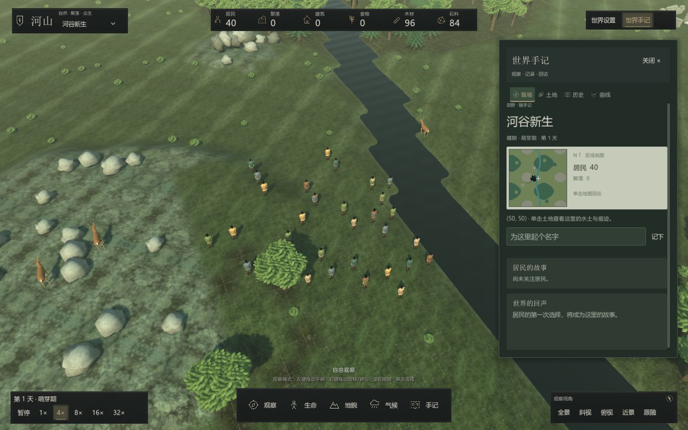

# 河山 · SandBoxSim

河山是一款以自然生态与居民自主行为为核心的 3D 沙盒模拟游戏。玩家塑造地形、水源和资源，规划土地与聚落；居民依据需求、材料与可达性选择生存、劳动、建造和迁移。人物档案、世界事件与每日曲线帮助观察这些选择的后果。

项目也提供独立的 [在线控制与效率实验接口](docs/development/online-efficiency.md)：HTTP 固定步进、正确性约束下的配对性能比较，以及固定预算/控制代理下的多轮自我改进证据验证。研究模式不改变自由探索玩法。

程序加速与代理改进能力分别评测。[代理改进协议](docs/development/rsi-improver.md) 实际执行代理自修改，并比较父/子产生后代的增益、冻结代理和只撤销自修改方法的对照；多轮程序更快不再直接标记为 RSI。



## 安装与开始游玩

源码运行环境为 **PowerShell 7、.NET 8 SDK、Godot 4.7.2 .NET**。从仓库根目录执行：

```powershell
./tools/install-sdk.ps1
./tools/setup-godot.ps1
./tools/godot.ps1 -Mode run
```

Windows 配置完成后可以双击 [Play-3D.cmd](Play-3D.cmd)。Linux/macOS 根据安装脚本输出设置 `GODOT_EXE`，再运行启动脚本。已有环境、工具链路径和常见问题见 [安装与启动](docs/guides/getting-started.md)。

世界没有必须完成的目标，可以自由移动镜头、查看居民或改变土地。**左键拖动平移、右键拖动旋转与俯仰、滚轮缩放**；单击选择或确认落点。底部“生命”“地貌”“气候”直接展开自由工具；没有委托、工程流程、目标或干预额度。完整操作见 [玩家指南](docs/guides/player-guide.md)。

## 当前游戏内容

| 内容 | 可以做什么 |
|---|---|
| 自然与生态 | 改变地形、水土和资源，观察天气、火灾、动物与逐渐累积的土地压实 |
| 自主居民 | 观察生存、采集、劳动、建造、迁移及家庭与人生记录 |
| 荒野探索 | 寻找花甸、苇泽、倒木林隙、泉眼、野果地、古树林、遗迹和矿脉，按自己的喜好命名地点并观察变化 |
| 观察与保存 | 使用图层、人物档案、历史和曲线；保存世界与会话进度，记录实验起点 |

人物页可旋转、俯仰和缩放肖像，并切换面部、手部与全身；握持、拿取和搬运跟随居民实际行为。人物使用连续手部蒙皮、独立指节和贴合面部的眼睑，模型与配件说明见 [3D 模型系统](docs/development/models.md)。

顶部食物、木材与石料表示已采集储备，包括居民背包、地面物资堆和仓库。地表节点仍需要采集；库存总量也不保证每位居民都能到达物资。

## 实验与 benchmark 接口

可通过独立评测模式运行固定场景，采集墙钟帧耗时与状态摘要，生成无标题的模型图像、视觉问题及答案，并回放人物界面操作。正常游戏仍为自由探索。运行方法、JSON 协议、模型预测格式和研究边界见 [评测接口与实验运行](docs/development/benchmark.md)，公开样例见 [评测场景](benchmarks/README.md)。代理实验提供有界策略选择、实际 Python 候选代码和 HTTP 程序优化三种后端，均保留迁移、失败与控制证据。这些接口用于可复现的开发实验，不代表已经验证 RSI 能力。重复采样与渲染缓存说明见 [性能维护](docs/development/performance.md)。

## 文档入口

- **开始使用**：[安装与启动](docs/guides/getting-started.md)、[玩家指南](docs/guides/player-guide.md)、[故障排查](docs/guides/troubleshooting.md)。
- **理解玩法**：[自由探索](docs/guides/exploration.md)、[世界系统](docs/guides/world-systems.md)、[聚落与居民](docs/guides/settlements.md)、[天气与生态](docs/guides/ecology.md)。
- **继续开发**：[开发指南](docs/development/developer-guide.md)、[项目架构](docs/development/architecture.md)、[扩展指南](docs/development/extending.md)。
- **维护项目**：[目录与文件管理](docs/development/repository-layout.md)、[构建与运行](docs/development/build.md)、[配置](docs/development/configuration.md)、[存档](docs/development/saving.md)。
- **查看更新**：[更新记录](CHANGELOG.md)、[版本更新与兼容](docs/guides/updating.md)。

源码入口见 [src](src/README.md)，工具入口见 [tools](tools/README.md)，公开实验与协议见 [benchmarks](benchmarks/README.md)。所有主题见 [文档导航](docs/README.md)。历史设计与阶段记录独立保存在 `docs/archive/`。

## 开发入口

```powershell
# 内核、命令行与测试工程
./tools/build.ps1 -Mode build -Configuration Release -Channel sdk -ParallelBuild

# 图形客户端：构建或打开编辑器
./tools/godot.ps1 -Mode build -Configuration Release
./tools/godot.ps1 -Mode editor

# 检查文档文件链接与大小写
./tools/check-docs.ps1
```

`SandBoxSim.sln` 包含 Core、Console 和 Tests；Godot 工程通过 `tools/godot.ps1` 单独构建。测试使用项目自带运行器，入口是 `tools/test.ps1`。逐项操作及验证选择见 [开发指南](docs/development/developer-guide.md)。

## 仓库结构

```text
SandBoxSim/
├─ src/                 Core、Console、Godot 与 Tests 四个工程
├─ config/              默认模拟参数与配置说明
├─ benchmarks/          公开场景、代理夹具、Schema 与 OpenAPI
├─ tools/               安装、构建、运行、测试与文档检查脚本
├─ docs/
│  ├─ guides/           安装、游玩、排错和版本更新
│  ├─ development/      架构、扩展、构建、配置、存档与素材
│  ├─ images/           正式文档配图，保留并提交
│  └─ archive/          原始要求、设计与历史记录
├─ .github/workflows/   核心与图形持续集成
├─ artifacts/           本机构建输出，忽略提交
└─ runs/                日志、模拟数据和临时截图，忽略提交
```

游戏纹理、插画和配方分别位于 `src/SandBoxSim.Godot/assets/textures/`、`illustrations/`、`gameplay/`。开发期间的临时截图放在 `runs/screenshots/`；清理临时截图时保留文档配图、游戏素材和存档。详细约定见 [文件管理](docs/development/repository-layout.md)。

贡献约定见 [CONTRIBUTING.md](CONTRIBUTING.md)，代码授权见 [LICENSE](LICENSE)。
