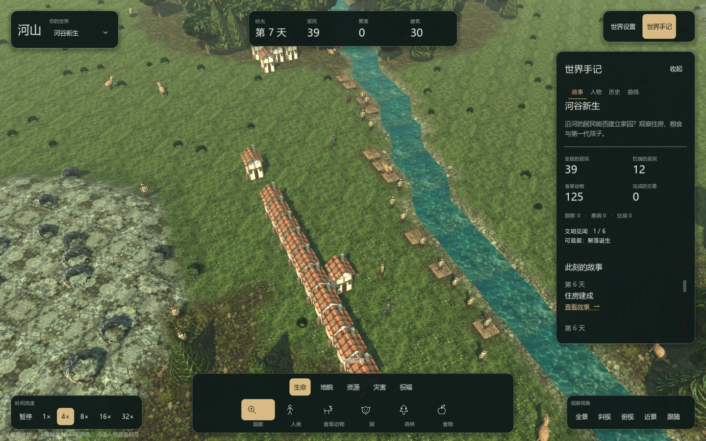
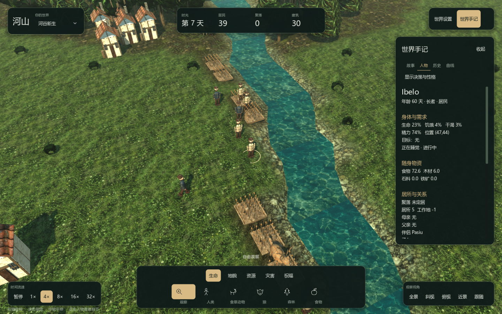
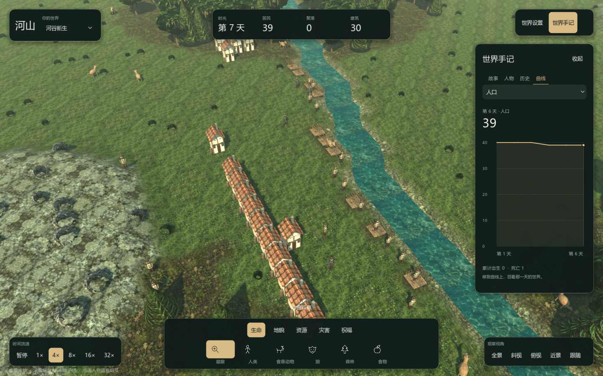

# 河山：3D 界面与视觉验收

> 历史设计与验收记录。当前版本操作见 [玩家手册](24-PlayerHandbook.md)，架构见 [开发指南](25-DeveloperGuide.md)，系统玩法见 [世界如何运转](26-WorldGuide.md)。

## 视觉方向

世界是主画面，HUD 使用深林灰、暖白文字与单一浅金强调色。界面采用浮动面板、轻边框、克制阴影和一致的圆角；工具、速度与分类的选中状态保持一致。工具栏使用项目原创矢量符号，不把地图物件缩成难以辨认的小图。

字号分为标题 21–27、主要数值 24–32、正文 14、辅助说明 11–12。面板间距采用 8、12、16、24 的尺度。右侧手记可以收起，工具参数仅在使用画笔时显示，全部规则与存档操作收进世界设置。

## 操作与内容

| 区域 | 内容 |
|---|---|
| 左上 | 世界名称、初始环境切换 |
| 顶部 | 日期、居民、聚落、已完成建筑 |
| 底部工具 | 生命、地貌、资源、灾害、祝福；图标、中文标签、工具提示、选中状态 |
| 左下时间 | 暂停及 1/4/8/16/32 倍速；空格切换暂停 |
| 右下镜头 | 全景、斜视、俯视、近景、跟随选中居民 |
| 世界手记 | 当前故事、人物或地块、事件历史、每日统计曲线 |
| 人物详情 | 身体需求、随身物资、居所关系、个人历史；性格与效用解释按需展开 |
| 统计曲线 | 八种指标、每日数值、网格与范围；指针经过曲线时回看当天样本 |

观察图层会随实际资源、湿度、肥力、领土和居民位置刷新。AI 图层在人物上方显示当前动作；路径图层使用独立的只读寻路器显示选中人物及镜头附近最多八条路线，不改写模拟的寻路统计。植被和食物节点的可见状态随采集与消耗更新，建筑槽位复用时按代次、种类与位置重新生成模型。

右键拖动旋转，滚轮缩放，中键拖动平移；WASD/方向键平移，Q/E 旋转，F 查看全景。镜头操作与检查器只读取模拟状态。

世界使用真实透视相机、带高度的网格地形、体积树木、建筑、人物和动物。地面材质降低过强的饱和度与高频对比；建筑缩小横向占地，给相邻房屋留下空间。这里仍是程序化模型，并非扫描模型或完整角色美术制作。

## 本地复核

运行 `./tools/godot.ps1 -Mode run`。Godot 4.7.2 .NET 与 .NET 8 为当前开发环境；`-Mode test` 先导入素材，再执行图形客户端自检。

2026-10-05 本机验证：

- Debug 构建：零警告、零错误。
- 完整内核测试：303 项通过，零失败、零跳过，646.70 秒；包含 20 个种子的 200 天批量验收与长期诊断。
- 客户端自检：工具、人物/故事跳转、检查器与曲线只读、存档往返、3D 几何、透视、旋转、缩放、拾取通过。
- 非默认地图：60×44 矩形存档恢复后，地形、植被、底座与相机使用实际世界尺寸；九个观察图层验证通过，渲染前后的模拟摘要一致。
- 布局检查：1280×800、1600×1000、1920×1080 的工具栏、时间栏、镜头栏无重叠，主要面板未超出窗口。另有 1280×800 原生窗口截图复核。
- NVIDIA RTX 4060 Laptop / OpenGL Compatibility，300 人、1440×900、4 倍速运行 30 秒（前 5 秒不计入帧率）：平均 95.38 FPS。此结果只代表这次短时本机样本，不能替代 30 分钟稳定性或其他硬件测试。
- 最终地形过渡与 mipmap 修改后，相同设置复测：平均 95.74 FPS，300 人仍存活，世界推进至 1200 tick。
- 补齐实时观察图层、植被节点更新与建筑模型失效处理后，最新同设置样本为 94.54 FPS，300 人仍存活，推进至 1200 tick。

证据保存在 `runs/full-delivery/ui-self-test.log`、`ui-dimensions-test.log`、`ui-fps-300.json` 与 `ui-*-final.png`。截图来自实际运行的游戏窗口。

## 与完整任务书的关系

本页只记录图形界面变更，不代表原任务书全部通过。100 天、200 人的内核性能目标仍需优化；原任务书逐项交付状态以 `20-FullDeliveryChecklist.md` 的证据为准。完整测试不跳过多种子与长跑案例。
