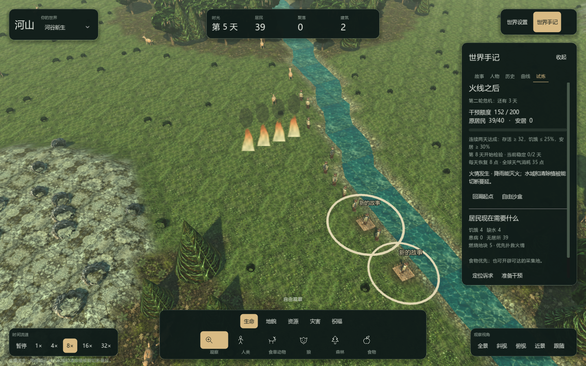

# 23 — 世界试炼与主动干预

> 历史设计与验收记录。当前版本操作见 [玩家手册](24-PlayerHandbook.md)，架构见 [开发指南](25-DeveloperGuide.md)，系统玩法见 [世界如何运转](26-WorldGuide.md)。

2026-10-05。这次玩法改动针对“放下居民后，只能等待”的问题：给玩家提前可读的风险、有限的干预资源、能定位的居民诉求与真实结果复盘。

## 开始游玩

启动图形客户端，右侧“世界手记 → 试炼”提供三种挑战。也可以从故事页进入。试炼使用当前世界，不清空居民或直接创建建筑；开始时自动记录实验起点，并切换到 8 倍速。暂停、调整速度与相机仍可使用。

| 试炼 | 第 4、7 天的环境变化 | 可尝试的策略 |
|---|---|---|
| 守住绿洲 | 两轮 48 小时旱季；居民附近土壤变干，当地食物节点剩余量乘以 0.55 | 引入可达水域、补充粮食、改善生产 |
| 火线之后 | 两轮干燥天气；居民周围最多点燃四块可燃地 | 降雨灭火、开辟水域或清除植被形成防火带 |
| 疫病来临 | 两轮感染，尝试感染原居民中约 20% 的存活者；实际传染、免疫和恢复继续由疾病系统处理 | 定位紫色标记的病人、治愈、维持补给 |

预警与倒计时按游戏天推进。自然地形、居民行动和已有免疫会改变危机后果；已经清除可燃植被的地块不会被强行点燃。

## 干预取舍

初始额度为 120，上限 200，每个游戏天恢复 8 点。观察与镜头操作免费。添加生命按数量收费；其他画笔按半径与强度收费，工具提示显示当前预计消耗。预算不足时整个操作被拒绝，世界不发生变化。全球天气每次消耗 35 点，局部工具通常更经济。

局部降雨增加土壤湿度；强度至少 25 时扑灭范围内正在燃烧的地块，保留未消耗完的植被。湿润土壤不等于居民能喝到水，缺水时仍需要可抵达的水域。

“居民现在需要什么”显示饥饿、缺水、患病、无居所与燃烧地块，优先定位火情，然后定位紧急居民。点击“准备干预”只选择合适的画笔并移动镜头，实际施加位置由玩家点击决定。

## 如何判断结果

目标从试炼第 8 天开始检验，截止第 14 天：

- 至少 80% 的**初始居民**仍存活。
- 存活初始居民中，饥饿者不超过 25%，至少 30% 拥有居所。
- 疫病试炼还要求患病者不超过 10%。
- 连续两个游戏天满足条件，才完成试炼。

初始居民使用带代次的稳定身份记录，补充新人或复用死亡槽位不能替代遇难居民。结果记录存活、安居、饥饿和干预次数；使用规则辅助会在结果中标记。试炼不授予虚构城市、联盟或其他社会结果。

退出试炼会保留环境后果，并返回无限干预的自由沙盒。选择“回溯起点”能重新尝试同一局。文件存档保存试炼状态、额度、危机时间和实验起点；旧存档没有试炼数据时按自由沙盒载入。

## 可见反馈与验证

燃烧地块有动态火焰和烟，患病人物有紫色标记；它们读取实际火灾和疾病状态。烟最多显示 256 个实例以控制透明绘制成本。火焰与患病标记不改变模拟状态。

三个种子、三种试炼、等待与有限额度干预共 18 次对照，原始结果见 [玩法对照数据](gameplay-balance.json)。在这组有限样本中：

- 等待完成 5/9，主动干预完成 9/9。
- 三个疫病试炼均从等待失败变为干预完成，结束时患病原居民降为零。
- 种子 4242 的火情：等待时原居民剩 31/40，主动扑救与补给后为 40/40。
- 干预不保证所有指标都更好；例如一个旱季样本虽更早完成，存活者反而少两人。不同干预会改变资源、劳动与行为链。

自动测试覆盖预算拒绝、免费观察、雨水灭火、原居民身份、每日危机、存档续跑、连续稳定条件、截止日期及上述真实玩法对照。客户端自检覆盖入口、工具准备、存档中的试炼与非递归实验起点、拒绝操作不改世界、火焰与疾病标记数量、观察只读。原生窗口截图检查右侧滚动布局。

本轮完整 Release 回归 311/311 通过、零跳过（616.61 秒）。随后新增的策略对照用例与八项试炼用例一起复核，9/9 通过；当前共 312 个不同用例被覆盖。SDK Release 与 csc Debug 构建通过，客户端最终自检通过。日志为本地的 runs/full-delivery/all-tests-gameplay.log、trial-tests-final.log 与 trial-client-final.log。

RTX 4060 Laptop / OpenGL Compatibility，300 人、8 倍速、先推进四天触发火情、1440×900 原生窗口运行 30 秒，前五秒不计：平均 42.71 FPS；结束时 282 人、195 栋已完成建筑、8160 tick。本机同时执行回归与玩法对照，此结果是短时压力样本，不代表 30 分钟稳定性，也不能与上一轮 4 倍速、初始世界的帧率直接比较。

这些结果证明干预能够影响实际局势，并非主观乐趣的保证；本轮没有替代原任务书的性能与长期稳定性验收。
