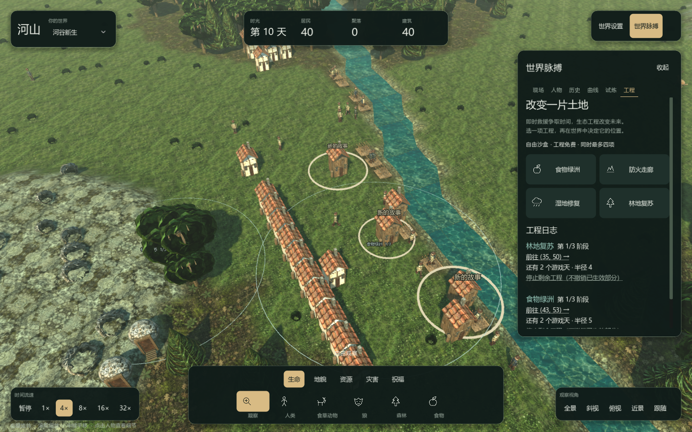
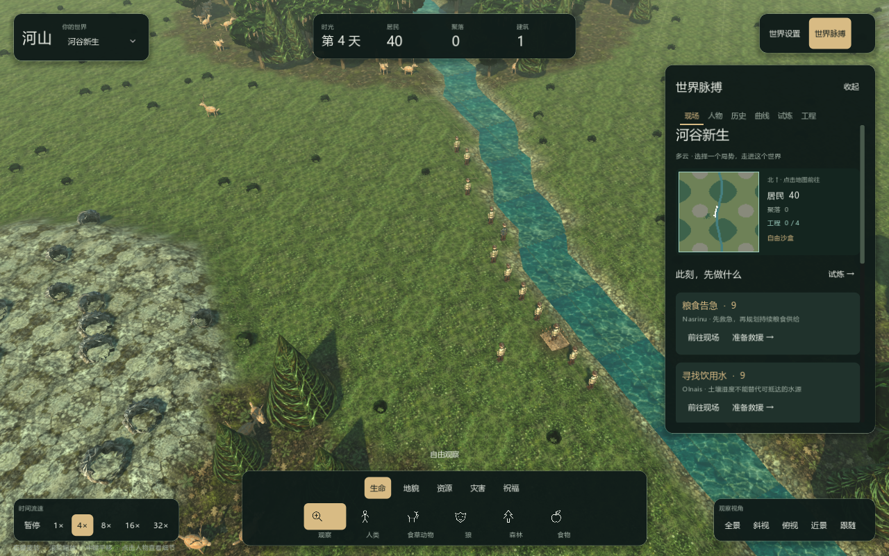

# 现场界面与土地工程迭代
日期：2026-10-05。目标是让观察、选择干预和看到后果形成连续玩法。

## 从读数走向行动
默认右栏改为“世界脉搏 / 现场”，先显示实际地形小地图和当前最紧迫的三项风险。每张卡片给出具体人物或位置，并提供定位与救助工具准备。风险颜色区分火情、疾病和生活需求；功能仍依赖真实模拟。

右栏宽 380 像素，六页保留人物、历史、曲线、试炼和工程。自然绿、浅色文字与暖色危险提示保持一致，工程采用薄荷色细线范围，不遮盖地形细节。镜头保留缩放、旋转、平移与人物跟随。

## 一次可以观察后果的选择
流程是：发现风险 → 定位现场 → 立即救助或规划土地 → 确认范围 → 等待三个日界 → 阅读前后报告 → 观察居民新行为。

四项工程改的是土地和资源条件，不强制居民移民、建城或完成剧情。阶段在地图上可见，报告保留实际前后数据。人物关注和改名让玩家能够持续看同一个人的经历，死亡仍有档案。试炼模式增加机会成本，自由模式允许继续实验。

工程、风险定位、人物关注与改名均支持客户端存档。小地图、镜头和风险读取保持只读；只有玩家确认的改名、工具、工程等操作改变状态。

## 实际游戏窗口
以下是本机渲染的运行截图，不是概念图。图中的计划、居民和风险来自运行中的模拟。

## 使用与验证
完整操作见 [玩家手册](24-PlayerHandbook.md)，状态与扩展见 [开发指南](25-DeveloperGuide.md)，测试、机器条件和未完成原始验收见 [交付说明](26-DeliveryAndValidation.md)。照片级自然美术与全部原始任务要求不能由这两张截图证明完成。
