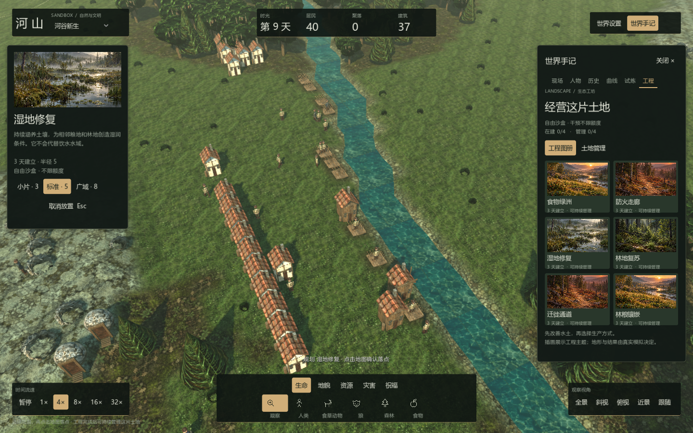
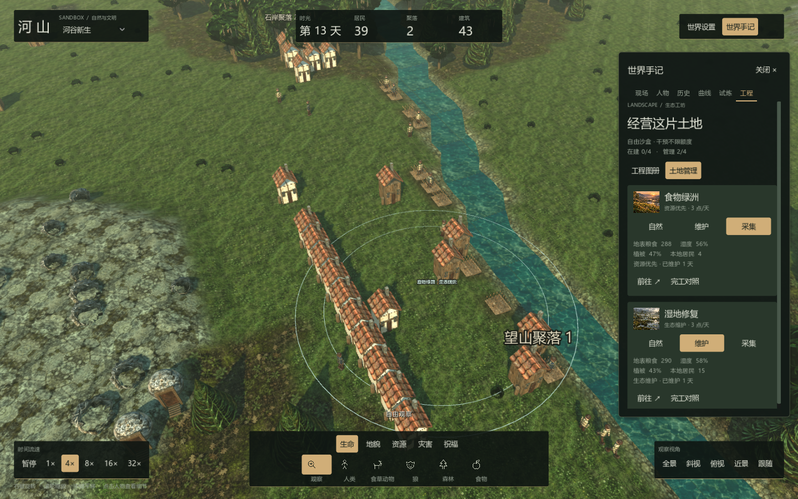
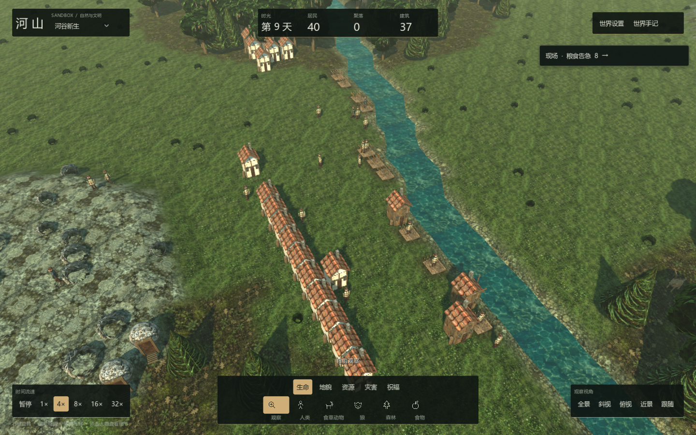
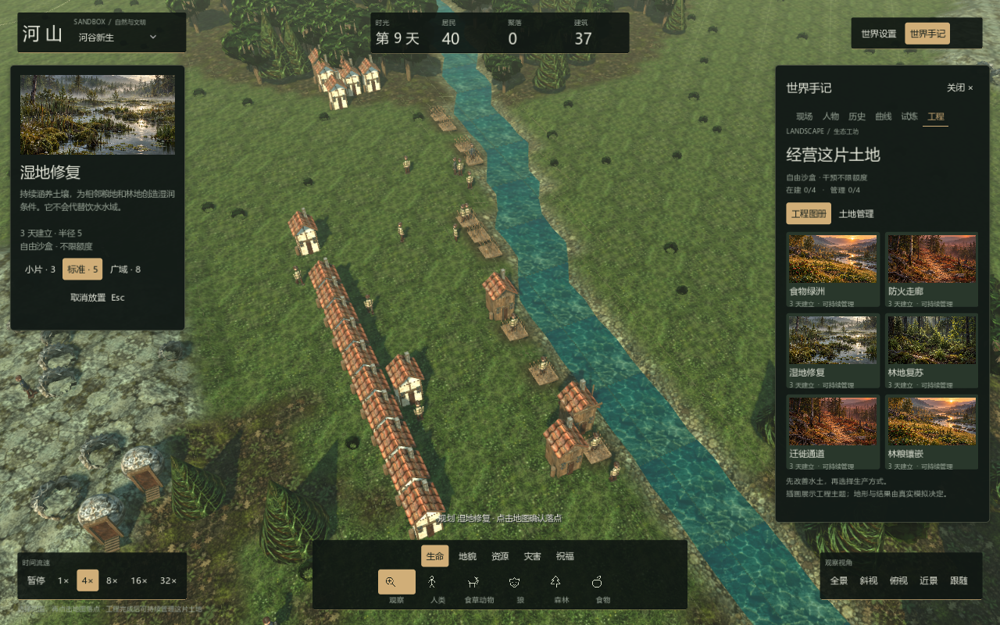

# 界面与交互设计
本轮以自然场景为中心，使用炭绿面板、暖铜色选中状态和原创生态插画。控制区域收缩为独立的小块，默认只显示世界状态、工具与现场提醒；需要观察细节时再展开手记。

## 世界视野
顶部左侧切换场景，中间显示日期、居民、聚落和建筑，右侧打开设置与手记。底部保留时间、工具分类和镜头控制。取消横贯窗口的大块纸面背景，减少对地形与生态细节的遮挡。

现场提醒展示实际最优先的风险，点击打开现场页。手记关闭时仍能看到提醒。手记打开后提供六个页签、真实地图、人物和历史，世界镜头仍可旋转和缩放。

## 生态工坊
工程图册采用原创自然插画区分主题。点击卡片后，左侧显示较大的插画、工程作用、范围和费用；右侧保持图册，便于比较。范围圈使用细线，左键确认落点，Esc 取消。

土地管理页用卡片区分每项工程。卡片显示实际进度或管理方式、当前地表粮食、湿度、植被和当地居民数。自然、维护、采集三个按钮切换政策；“完工对照”展开冻结报告。新状态与历史对照分别阅读，避免把持续变化当作一次固定奖励。

## 配色与可读性
深色炭绿表面承接场景的树影，暖铜色标识操作选择与标题，浅灰绿用于次级说明。图标、菜单、输入框、历史链接和曲线使用统一颜色。火情、疾病和需求有各自的提示色；人物状态条将危险值单独标记。

工程插画是主题说明素材，地图、人物、地块数值、施工进度和管理效果来自真实模拟。四幅插画来自内置 imagegen 工具，存放在项目 assets/Art 目录，提示和来源见 [美术资源](22-ArtAssets.md)。

## 世界反馈
真实天气和模拟日间进度驱动光照、太阳角度与雾气，变化平滑过渡。建设与持续管理区域保留 3D 圈与标签，小地图同样标记。视觉读取状态，不改写天气、时间或随机数。

## 阅读
[玩家手册](24-PlayerHandbook.md)说明操作，[世界如何运转](26-WorldGuide.md)解释系统，[生态工坊与扩展](28-EcologyWorkshop.md)说明组合策略与配方，[开发指南](25-DeveloperGuide.md)说明源码。
