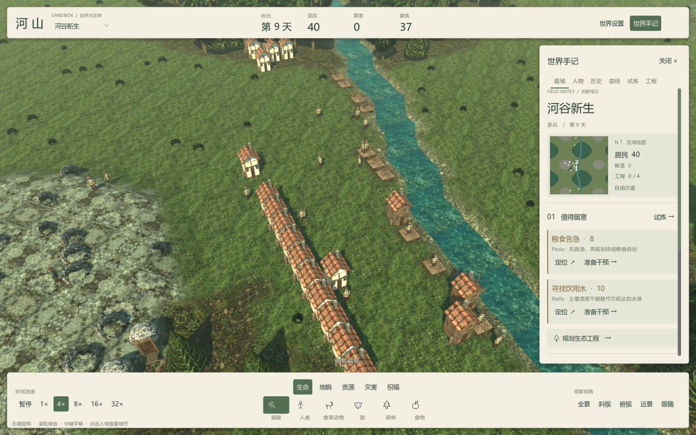
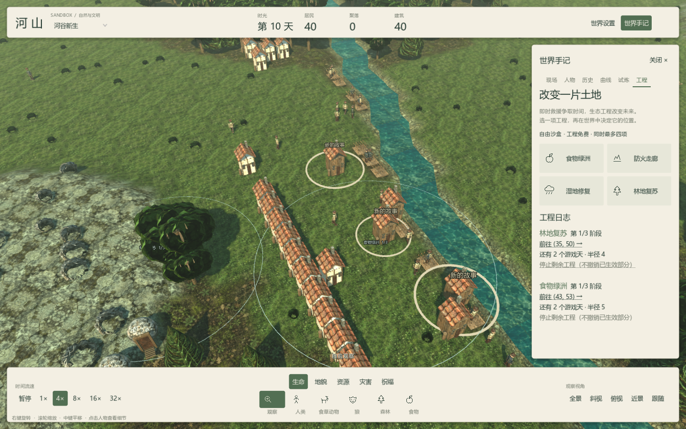
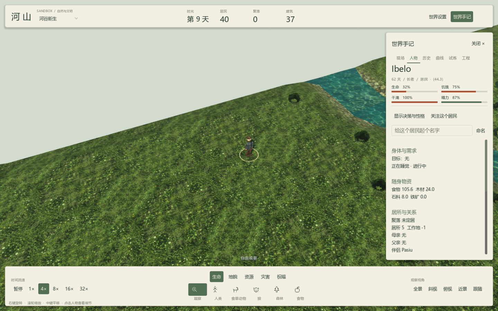

# 界面与交互设计
《河山》的界面采用暖白纸面、森林绿文字和细线分隔。世界始终占据完整窗口，控制栏与手记悬浮在场景上，保持缩放、旋转和平移的连续操作。

## 布局
顶部是连续的世界状态栏：左侧切换场景，中间显示日期、居民、聚落和建筑，右侧进入设置与手记。底部是连续工具栏：时间在左，干预工具居中，镜头视角在右。工具分类与当前选择使用森林绿强调，悬停有轻微底色反馈。

右侧手记宽 344 像素，用细线和编号组织现场、小地图、风险、人物与近期事件。六个页签切换不同观察任务。手记可关闭，释放完整世界视野；设置和工具参数放在左侧，避免挤压主工具栏。

## 配色与文字
- 暖白纸面：#f3efe3，用于控制栏和手记。
- 深绿文字：#263b32，用于标题、指标和可操作内容。
- 森林绿：#526f53，用于选中状态与主要链接。
- 灰绿辅助文字：#70776a，用于说明与次级信息。
- 火情、疾病、生活压力分别使用铁锈色、灰紫色和赭色。

图标、文字、输入框、菜单和曲线使用同一套主题。场景里的浮动提示单独保留浅色文字与阴影，以便在土地上阅读。

人物页把姓名、年龄、身份和位置放在顶部，用四条状态条显示生命、饥饿、干渴和精力。饥饿和干渴越高，需求压力越大；生命和精力越低，越需要留意。危险值使用铁锈色，详细行动、物资、关系与历史保留在下方。

## 观察与行动
现场页显示真实小地图和最多三项优先风险。风险条使用左侧细线区分类型，提供定位与准备干预；准备工具不会自动施加救助，仍由玩家在世界中确认位置。

工程页负责选择与阅读进度，地图负责确认范围。人物页负责关注、改名与深入查看行为。历史与曲线支持回看后果。把“看到局势—选一种改变—观察回应”放在同一套布局里，减少在设置之间来回寻找功能。

## 当前游戏画面

## 文档入口
[玩家手册](24-PlayerHandbook.md)说明操作，[世界如何运转](26-WorldGuide.md)解释系统与策略，[开发指南](25-DeveloperGuide.md)说明源码与扩展。
