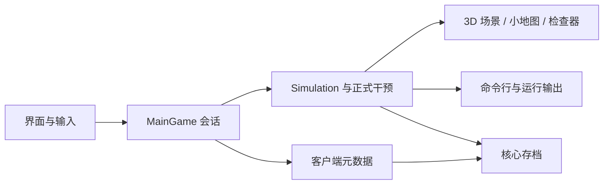

# 项目架构

## 工程分层

| 工程 | 职责 | 依赖 |
|---|---|---|
| `SandBoxSim.Core` | 世界、实体、行动、资源、生态、社会、事件与存档 | .NET BCL |
| `SandBoxSim.Console` | TUI、命令行模拟、统计、报告与 PNG 输出 | Core |
| `SandBoxSim.Godot` | 3D 场景、输入、界面、观察与游戏会话 | Core、Godot .NET SDK |
| `SandBoxSim.Tests` | 自带测试框架与行为、确定性、存档回归 | Core、Console |

Core 不依赖图形引擎；Console 和测试可通过 SDK 或 Roslyn csc 构建。图形客户端负责把玩家选择转换为正式干预，不以界面数字代替模拟状态。

## 目录与职责

Core 中 `Foundation` 提供配置、数学、随机数和基础数据；`World` 存储地块与建筑；`Agents` 存储人物与动物；`Systems` 承载行为和世界规则；`Pathing` 提供寻路；`History` 与 `Save` 记录事件与持久化状态。

| 文件 | 作用 |
|---|---|
| `MainGame.cs` / `MainGame.Play.cs` | 会话创建、时间推进、存档、干预与自由探索 |
| `MainGame.Interface.cs` | 主界面、布局和人物信息 |
| `HudStyle.cs` / `HudBevel.cs` | 材质、配色、描边和交互样式 |
| `ResidentPortrait.cs` | 独立 3D 肖像与旋转、缩放输入 |
| `BuildingPortrait.cs`、`HudSymbols.cs` | 独立建筑展示、悬停转向与概览/操作符号；静止预览缓存 |
| `MainGame.Operations.cs` / `MainGame.Notebook.cs` | 观察、人物关注和田野手记样式 |
| `WorldView3D*.cs` | 镜头、地形、实体、天气与风险表现 |
| `NatureModels*.cs` | 可复用几何、人物、动物与建筑组合 |
| `ProjectCatalog.cs` / `LandProjects.cs` | 历史 SDK 系统，当前客户端不加载或推进 |
| `ConstructionOrders.cs` | 成年居民、可达性与真实材料建造事务 |
| `SettlementBlueprint.cs` | 本地目标观察、稳定日界与进度持久化 |
| `WildPlaces.cs` / `NatureModels.WildPlaces.cs` | 种子地貌、自然作用、地点手记与 3D 外观；由图形会话推进 |
| `WorldTrial.cs` / `WorldAlerts.cs` | 历史 SDK 系统，当前客户端不使用 |

上表中的客户端文件位于 `src/SandBoxSim.Godot`，规则文件位于 `src/SandBoxSim.Core/Systems`。

## 时间与会话

`Simulation` 按 tick 推进内核；图形会话的 `AdvanceWorld` 按日界拆分推进，仅更新模拟与荒野地貌；客户端已删除委托、工程、试炼和蓝图流程。高倍速仍处理每个日界。直接调用内核 `Tick` 不会执行客户端会话计划。

## 状态与观察边界

镜头、图层、人物检查和地图查询保持只读，不消耗模拟随机流。动画与天气光照读取内核状态；建筑外观由位置和种子决定，不改变造价、床位和产量。自然住房布局是可保存规则，新图形世界开启，旧存档与命令行默认沿用原设置。

稳定人物身份用于关注、改名、家庭与人生档案，不能把可复用的实体槽位当作永久身份。富文本中的用户名称须转义。

扩展数据见 [配置](configuration.md)，恢复与续跑契约见 [存档与确定性](saving.md)，验证入口见 [构建与运行](build.md)。

荒野地貌仅在新建图形世界初始化，使用种子与固定整数混合生成，不消耗运行中的模拟随机流。每日涵养与结果读取真实条件；生成的资源计入实际节点，额外有机生长计入再生总量。地点和日界进度保存于客户端元数据，Console 不执行这一层。
