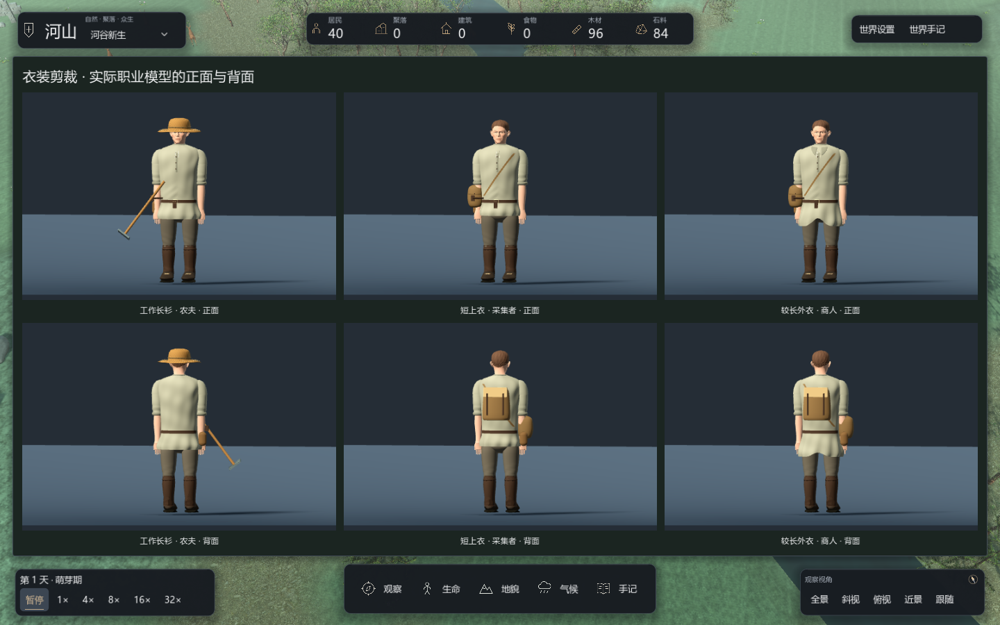
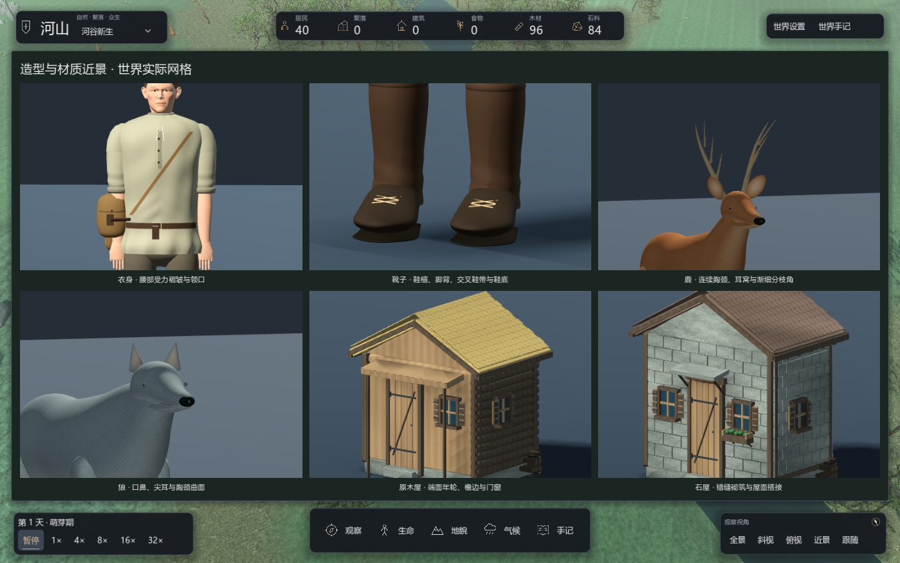
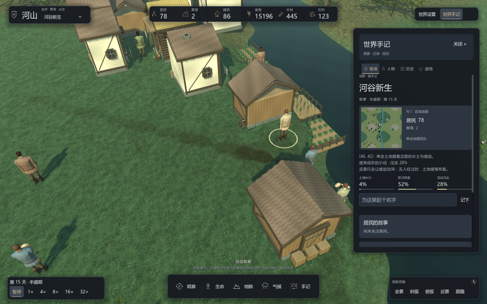
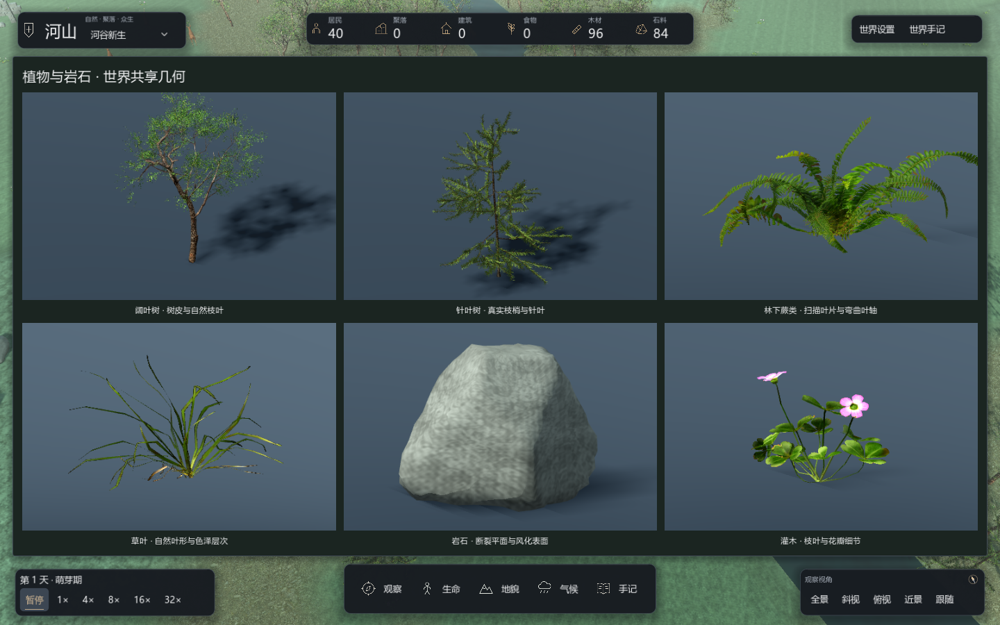

# 3D 模型系统

地图、人物档案和建筑图册使用同一套实际网格。人物头脸使用经过许可的 Blender Studio 写实基础网格及运行时变体；植物使用 Poly Haven CC0 环境模型与 PBR 贴图；衣身、骨骼关节、动物、房屋及地形继续由 C# 构造，结合材料图集与程序化表面。图册展示共用模型，世界存档保存居民、建筑与资源状态。

## 建筑

住房有原木屋、灰泥屋、石屋、高山墙屋和单坡屋五种轮廓。稳定身份决定宽深、楼高和变体；住房横向尺度与屋顶跨度扩大，灰泥屋、石屋和高山墙屋采用居中入口及左右窗，高山墙/灰泥立面保留竖向木柱与横向木梁；道路决定地图中的朝向。当前门洞、墙高和图册镜头按人物尺度重新调整，模拟建筑占地与通行规则沿用内核数据。

门由独立木板、门框、过梁、铁带和门闩组成；窗有外框、格栅、侧板和窗台；近景侧板补充四层木条和上下铁带，细件并入建筑网格，远景保留原有外轮廓。近景坡屋面采用 12 行、18 列铺设，减少单块瓦片的厚重感；远景保留较稀铺设。坡屋面有错缝分层瓦片、檐木和山墙边条；近景每块瓦片采用 5×5 曲面采样，远景仍为简化截面；瓦片使用弧面截面，草束屋面带细小起伏与参差边缘。木作、瓦片和砌石具有浅倒角，门板有斜撑、铰链和铆钉；近景补充门框接缝、石质门槛和下缘钉头，全部并入静态网格，单坡屋有坡顶墙面。石屋与基础使用带细倒角的砌石，侧墙有木架；部分住房有烟囱、檐柱、木料与桶箍。

仓库保留宽门及门前物料；农田采用植株、叶片与通透围栏；矿场具有暗洞口、支架、轨道与矿车。未完工建筑使用基础、立柱、斜撑和材料堆。

近景住房补充两侧窗框、窗台和檐下木作，绕到侧面也能读到结构。石屋采用隔行错缝与边缘半块石，避免整面墙呈现对齐网格；入口雨檐与斜撑随房型变化，近远模型均保留雨檐外轮廓。新增零件仍合并进建筑缓存，远景省略侧窗和檐下细件。


## 人物与动物

### 衣身剪裁与缝制结构

成人衣身当前有三种独立网格：工作长衫的下摆高度为模型局部 0.60 米，采集者、猎人和士兵的短上衣为 0.63 米，商人的较长外衣为 0.535 米；其他成人职业使用工作长衫，儿童沿用工作长衫并接受原有年龄缩放。职业改变实际衣身轮廓，不只添加职业配件。它们是表现层剪裁，不新增服装库存、制作配方或委托。

衣摆包含向内折回的内衬边，领口具有封闭截面的翻折厚度；工作长衫和短上衣去掉大块平面领片，较长外衣保留折领。袖口采用中空卷边并与袖端衔接，去掉旧白色实心袖带和硬质亮缝线。裤腰与胯部有连续网格，连接两条可动裤腿，短上衣露出裤腰时也能保持身体完整。靴筒使用同系列皮革表面，靴口由闭合折边截面构成，替换原先亮色实心环。

腰包具有连续鼓腹轮廓和双层弯曲翻盖，翻盖由实际包身三角面求交，保持 1–2.5 毫米层间距并封闭边缘。配件网格、衣身采样及合并缓存包含剪裁编号，儿童和成人剪裁也进入缓存键；三种衣身共用相同肩部和握持关节。局部坐标采样按剪裁缓存，复用角色时不重复扫描相同的表面。

`--panel=wardrobe` 使用同一身份与色泽展示三种职业模型的正背面，回放配置见 [visual-wardrobe.json](../../benchmarks/scenarios/visual-wardrobe.json)。衣装检查覆盖三种网格、下摆高度、配件贴合和缓存；皮具检查覆盖双层翻盖、层间距、法线与边缘。



近景头颈、耳部、鼻翼与口腔来自 Blender Studio 的写实人体基础网格，保留其解剖拓扑。头颈包含 17,689 个顶点、34,585 个三角面，唇部和左右眼球独立连接现有动作。转换与署名见 [人物头脸素材](human-assets.md)。八种宽度和纵深变体来自稳定身份；面部挂点继续从实际三角面求交，包含眼球与嘴唇。

发型以稳定结构选择三类发束走向和短发起伏，发壳在额头外保持包覆；远景头部缓存包含脸型，保留相同发壳偏移。耳朵具有耳轮、对耳轮与内凹耳窝。眼睑开口和眼白采用更低对比的色泽，眨眼与视线沿用原有表现状态。肩部连接曲线降低鼓起幅度，手臂挂点收至左右各 0.202 米；袖端埋入可变形肩部，避免封口面形成水平台阶。衣身胸肩截面同步收窄，头颈挂点降低 3 厘米，继续接受抬臂、握柄和暂停检查。

门襟是贴合衣身的曲面条，纽扣、分段系带采样同一表面；腰扣由开口框架与扣针构成，替换原实心金属色块。布料编织色差减弱，衣身与关节褶皱仍由网格产生。鹿和狼上腿包含股部体积，前后下腿使用分别缓存的截面，后腿显示跗关节弯曲。毛皮使用随屏幕采样衰减的颜色细纹与微小法线起伏，保持连续表面；不加载逐帧生成的毛束。

衣料采用灰绿、亚麻灰、灰棕与蓝灰的低饱和配色。衣身在腰带下方形成纵向垂褶，腰部压缩区和胸部有不同的曲面变化；衣袖肘部、裤腿膝部与靴筒踝部补充局部褶皱，截面每段八级细分。衣身写入环绕 UV，配件继续采样变形后的实际表面，握持和肩部蒙皮沿用原有关节。

靴头和鞋底采用同一鞋楦轮廓：前掌较宽、鞋腰收窄、脚背隆起、后跟收束，端部在宽度与高度两个方向同时收敛，避免旧椭球拼接和尖角。鞋带为四组交叉细绳，鞋面使用带采样衰减的皮革微纹理；零件仍按脚踝合并并随动作移动。

鹿和狼的胸颈背采用单张连续截面曲面，取消原先胸、颈两张封闭网格交叠产生的端面和鼓包；狼的躯干降低，保留原有对角步态。耳朵包含前后表面、内凹耳窝与闭合侧缘，狼耳采用渐尖轮廓；鹿角由弯曲、渐细且末端收束的管面组成。尾巴改用沿弯曲中心线变化的截面，眼部缩小并贴近头部，口鼻补充鼻孔与唇缝。闲置时胸廓轻微呼吸，暂停时冻结。表面仍为程序化风格化模型。

`--panel=model-details` 展示同一套世界网格的衣身、靴子、鹿头、狼头与建筑近景，不替换高精度展示专用资产。公开回放为 [visual-model-details.json](../../benchmarks/scenarios/visual-model-details.json)。几何检查涵盖鞋楦和鞋底朝向、耳朵和鹿角的有限几何/法线、缓存复用及完整模型预算；动作与观察纯度继续由 Godot 自检覆盖。

动物腿根起始截面收束并埋入躯干，上腿与躯干之间保留交叠。检查对鹿、狼各采样 16 个移动姿态，用实际躯干三角面求竖直线交点，要求四条腿的根部保留包覆余量；不是仅检查关节落在模型包围盒里。



人物有八种稳定面部结构，连续调整下颌到上脸的宽度和纵深，头发按同一变体贴合。当前共用一个写实男性基础网格，没有独立女性或年龄专用雕刻。头部网格按肤色、发色、职业和变体缓存，衣装剪裁另行缓存；改变衣服不会重复构造头部。衣身使用 64 周向、40 纵向分段和连续截面插值，腰带区域减弱褶皱，保持配件贴合。手部包含连续掌形、手指与拇指，裤腿和靴筒使用连续轮廓；肩肘、髋膝动作由表现层关节驱动。

近景读取仓库中的头脸数据，远景继续使用低分辨率轮廓。头发壳通过实际头颅的二维查找表贴合，耳部不再叠加独立程序耳廓。眨眼保持眼球的原始尺寸，通过眼睑闭合表现，稳定身份提供不同相位；面部和动作不修改模拟状态。

鹿和狼收窄头颈，眼部位置跟随头部比例调整，下颌用连续截面曲面代替独立胶囊。鹿和狼使用独立的胸腹、肩背、颈部和头部截面，包含眼、口鼻、内耳、蹄或脚掌以及尾。鹿保留分枝角；狼采用尖耳和较低肩背。四条腿具有独立关节，移动时形成对角步态，停止时收敛到站姿；暂停停止关节变化。动物连续截面使用至少 40 周向采样、每段六级细分；毛发表面按法线朝向区分腹部浅毛与背部色泽，避免头部局部高度造成颜色跳变。毛发细纹按实际屏幕采样范围减弱，避免远景噪点。

胸部通过躯干前段连续延伸进入颈部，取消叠加球体形成的鼓包；狼的颈部与头部降低，脚掌改用连续足背和足底曲面，以浅凹区表现趾间变化；鹿蹄使用左右独立的两个蹄瓣，随原有腿部关节移动。胸腹、后躯和颈部截面进一步收窄，脊背过渡更平顺。零件仍按关节与材质合并，并接受现有网格预算与步态检查。


### 面部与肖像

眉毛使用贴合面部的渐细弧面，降低厚度和弧顶高度；皮肤提高粗糙度并降低镜面反射，减轻塑料光泽；眼球保留原始角膜曲面与实际法线，眼白、虹膜、瞳孔和高光由项目材质控制。原网格提供眼窝、下眼睑、鼻翼和唇形，避免额外贴片遮盖解剖结构。面部深度采样按变体与坐标缓存，检查覆盖八种网格、有限法线、眼口挂点和眼球眨眼期间的体积保持。

模型图册与人物肖像使用中性蓝灰背景和较低环境填光，使材质与轮廓更容易观察；真实世界仍使用天气和时间驱动的光照。金属扣件与窗面使用独立的粗糙度和反射参数，木石、布料与毛皮保留低对比表面变化。

虹膜由稳定脸型选择灰蓝、棕、灰绿和榛色；唇部保留低对比暖色顶点层。皮肤使用项目现有粗糙度与微纹理，没有加载照片皮肤纹理。发型沿曲面分缝和发束走向着色，随屏幕采样减弱细纹。视线变化移动虹膜，眼球不旋转或压扁；交谈和进食沿用轻微唇部活动。`--panel=faces` 展示正面和侧转面部，预览不构成游戏目标或委托入口。


早期程序面部的 [眼睑与视线演示](../images/resident-face-motion.gif) 保留为历史专题；该 GIF 不展示当前授权头脸。当前画面以本节近景截图为准。

## 配件与衣装贴合

草帽由双层帽冠、开孔帽檐、檐边、环绕缝带和编织表面构成，帽冠包住额头和头顶；头盔采用开放底部的壳体，并在耳后与颈侧延伸。它们挂在 `Headwear` 节点下，随头部的年龄比例、朝向与呼吸姿态运动。

围裙、护胸、腰带和斜背带从衣服的实际三角面采样，不再用浮在身体前面的矩形或直线替代。曲面层与衣服保留 4–6 毫米的表现间距。行囊通过 `PackMount` 贴合后背，采用圆角皮革轮廓、盖片与扣带。

近景衣身与衣袖的连接使用 `Skeleton3D`、三根绑定骨骼和逐圈权重，肩部圆顶与衣身合并到同一个蒙皮网格。连接根圈埋入衣身，末圈跟随上臂；前臂承担握持所需的扭转，上臂保持较小扭转，避免抬臂时露出断面或压扁肩部。内层肩部组织与双面衣料补足近景遮挡。

人物具有独立手腕、四指的三段指节、两段拇指和脚踝。工具通过 `HandGrip` 横穿合拢的手指，手部目标由肩肘两节逆运动学求解，肘部弯曲面跟随手掌而不是固定向后；左右手使用镜像握持朝向，支撑手跟随实际移动的手柄。作业轨迹与腰侧收纳角度使手掌和前臂保持较小夹角；徒手、搬运和进食允许手腕随前臂调整，避免强制世界朝向导致反折；俯身围绕髋部旋转，脚踝补偿小腿倾斜。工具在腰侧 `BeltToolLoop` 与手掌之间切换父节点，只在手已接触收纳位置并合拢手指后转移；放回先落位，再松开手指。每只近景手使用 16 根骨骼：掌部、四指各三节、拇指两节及前臂过渡。指节驱动连续蒙皮表面，腕部根圈随前臂运动，指根埋入掌形；不再直接渲染一串分离的胶囊。不同长度的手指分别配置闭合角度。手指截面在指节处带细小起伏，表面法线从实际几何重算。指甲曲面贴近手指表面，作为独立材质表面加入同一手部网格，绑定末节指骨，随手指运动；不增加悬浮挂件节点。检查包括各段指骨与变形后的手部表面，防止仅看指尖而漏掉中间指节穿柄。停止作业从当前姿态收回，而不是跳到固定准备姿势。

内核的采集动作可能在一个 tick 内完成。`PresentAction` 对实际 `Done` 状态补足一次有界的可见动作，避免渲染帧漏掉短暂的执行阶段；不重复采集或结算，不消耗模拟随机流。相同完成状态不会反复播放，新的行进、失败或紧急行为取消补播。补播与骨骼姿态只属于表现层，不写入世界存档。

工具与动作由真实的 `ActionKind` 和 `ActionPhase` 驱动，前往作业地点时可取出工具，到达后才开始作业；停止作业后收回。工具是表现层几何，不新增工具库存或改变作业收益。

| 真实动作 | 外观与动作 |
|---|---|
| 采伐木材 | 斧头、双手支撑与挥击 |
| 采集石料 / 铁矿 | 弯曲镐头、双手握持、蓄力与快速下击 |
| 耕种 | 长柄锄头、双手推拉 |
| 建造住房 / 农田 / 仓库 / 矿场 | 锤头、取出、抬臂、锤击与收回 |
| 采集食物 / 取回物资 | 俯身、屈膝、伸手与手指收拢 |
| 存放 / 分享 / 交易 | 双手递送 |
| 进食 / 饮水 | 手移向口部 |

木料束与物资袋根据居民的实际非零库存显示，代表主要携带资源，不按袋子数量计算库存。儿童不使用成人工具。近景独立指节参与握持，远景采用合并的手部、头部及覆盖肩部的静态衣装轮廓，近景与肖像保持完整曲面和指节；距离较远的人物降低姿态更新频率，根节点移动仍连续。近景手指只在闭合程度变化时提交骨骼姿态，删除已被蒙皮替代的胶囊网格节点，减少重复更新和隐藏节点开销。暂停冻结表现层动作，不推进模拟或随机流。


## 植被与地貌

阔叶树和针叶树使用授权衍生模型，保留自然枝条与树皮、叶片材质。地图中的树干、枝条、冠层和岩石按 24 米网格分区批量绘制；每批保留自己的包围盒，镜头只绘制可见区域，保持原有植被几何和位置。古树林、野果地和遗迹复用同类叶片、石材与木材；岩石采用低频断面轮廓和倾斜层次，从变形后的三角面累积法线并合并环绕接缝，避免仍按球面着色的软团感。表面保留低对比纹理、粗糙度与材质差异。



早期地表模型专题见 [历史自然图册](../images/nature-detail.png)。

## 自然造型与材质层次

当前表现更新覆盖人物、鹿狼、阔叶树和针叶树、灌木、蕨类、草叶、岩石、地表、水面及建筑材料。人物使用授权基础头脸，植物采用专业环境素材，动物、服装、建筑与地形仍包含项目程序网格；本次没有加入完整写实角色动画库。

人物降低肩部鼓起，袖身与前臂改用更收束的轮廓；皮肤、眼球和发丝校准粗糙度及反光，眼白保留暖灰层次。动作与工具仍使用原有骨骼和取用状态，自检检查暂停、握持、腕部与肩部连续性。当前角色共用同一男性基础头脸，年龄缩放不等同于独立儿童雕刻。

鹿与狼的头部增加额部到鼻梁的截面，鼻部由连续截面替代椭球，虹膜、瞳孔和微小高光分别构造。耳朵比例缩小并成为独立关节，闲置时小幅转向，暂停后停止；世界中的动物从稳定身份取得不同表现相位。毛皮通过低频色层和屏幕衰减细纹表现，没有加载逐帧毛束或更改动物行为。

阔叶树、针叶树、蕨类、草丛和灌木使用 Poly Haven CC0 素材的衍生网格，保留 1K 的颜色、法线、粗糙度与透明遮罩。树木按完整叶片单元抽样，木质部分独立简化；蕨类、草叶和灌木保留源素材的轮廓。网格和多材质由世界与图册共用，树木保留导出叶片索引以维护轮廓，其他低矮植物继续使用屏幕 LOD；来源、转换和尺寸见 [环境素材](environment-assets.md)。林下蕨类由真实植被、湿度与火灾状态筛选，稳定位置序列不消耗模拟随机流。

岩石采用不规则断裂平面的径向交点构造轮廓，法线由实际网格累积。地形保持既有连续地面采样，将规则正弦波纹换成两尺度稳定噪声起伏；水面、道路与压实处减弱起伏，居民和建筑仍从实际地面取高度。地表细砂与木石表面的微法线随屏幕覆盖减弱，避免用大量新增几何表达微小材质变化。水面校准浅岸色、波纹反射与粗糙度。

石砌住房和基础的近景砌块采用浅倒角，远景保留原轮廓；木材、石材、灰泥、瓦片与草束使用统一的低饱和自然色系。世界天气光照、图册中性补光分别维护，图册不使用专用替身模型。

`--panel=ecology-details` 和 [visual-ecology-details.json](../../benchmarks/scenarios/visual-ecology-details.json) 提供树、蕨类、草叶、岩石与灌木的世界共享几何近景。语义裁切标签包含 `tree`、`fern`、`grass`、`rock`、`shrub`；这是对象识别输入，不是游戏任务。植物自检覆盖有限顶点、单位法线、三角面朝向、属性长度、根部范围与缓存预算；完整场景另外核对实际画面和性能。



## 源码入口

| 文件 | 作用 |
|---|---|
| `NatureModels.Buildings.cs` | 建筑轮廓、屋顶与窗结构 |
| `NatureModels.ArchitectureDetail.cs` | 门、屋面搭接、砌石、支架与道具 |
| `NatureModels.Residents.cs`、`NatureModels.Tailoring.cs` | 人物衣装、四肢、手部与配件 |
| `NatureModels.Equipment.cs` | 帽壳、贴合衣装与背包挂点 |
| `NatureModels.HandTools.cs` | 工具模型、腰侧与手掌挂点、库存携带外观 |
| `NatureModels.HandSkin.cs` | 连续掌形、手指与腕部过渡的蒙皮网格和绑定 |
| `ResidentRig.cs`、`ResidentRig.HandPose.cs` | 真实行为呈现、收纳切换、肘腕求解、指节姿态与手部骨骼 |
| `NatureModels.Articulation.cs` | 连续蒙皮衣袖与肩部结构 |
| `NatureModels.HumanAsset.cs` | 授权头脸数据读取、哈希、结构变体与头发表面查找 |
| `NatureModels.Face.cs` | 实际眼球、唇部、眼睑、眉毛与虹膜表现 |
| `NatureModels.ResidentLod.cs` | 保留轮廓与肤发色的远景头部网格 |
| `NatureModels.HandlingValidation.cs` | 工具转移连续性、握持、作业、切换、携带与暂停检查 |
| `NatureModels.Sculpture.cs` | 远景头部、贴合发壳与布料表面 |
| `NatureModels.Animals.cs`、`AnimalRig.cs` | 动物解剖轮廓、材质与四足步态 |
| `NatureModels.Meadow.cs` | 保留的程序草叶构造器；当前世界使用授权草丛数据 |
| `NatureModels.Botanical.cs` | 程序植物辅助结构、材料与植物几何检查 |
| `NatureModels.ScannedEnvironment.cs` | 专业环境素材读取、哈希、多材质与地面绑定 |
| `WorldView3D.Relief.cs` | 地形的稳定噪声起伏 |
| `NatureModels.Vegetation.cs` | 树冠、针叶枝层与树干 |
| `NatureModels.Craft.cs` | 平滑截面、倒角石块与连接构件 |
| `NatureModels.Surface.cs` | 木纹、灰泥、石材、屋面和植被的表面处理 |
| `NatureModels.RoofSurface.cs` | 弧面瓦片、草束起伏、边缘与封闭截面 |
| `NatureModels.CharacterSurface.cs` | 耳廓曲面、肤色表面和发丝着色 |
| `NatureModels.Validation.cs` | 曲面朝向、网格完整性、静态合并与关节检查 |

地图中的建筑同时缓存近景与远景网格；远景减少曲面细分和小构件倒角，保留同一屋面排布、轮廓与材质。进入 24 米以内切回近景，离开 32 米以外切回远景，避免在边界反复切换。模型图册始终使用近景几何。

新网格需要采用 Godot 的顺时针正面约定，并保持朝外法线。截面插值保留轮廓；不要仅提高球体细分来替代身体结构。静态部件按材质合并，动物和居民保留活动关节。建筑变体键限制到 140 个稳定组合，图册和地图共用缓存规则。

## 独立预览

先运行 `./tools/godot.ps1 -Mode build -Configuration Debug`，再通过 Godot .NET 可执行文件打开项目：

```powershell
& $env:GODOT_EXE --path src/SandBoxSim.Godot -- --panel=architecture
& $env:GODOT_EXE --path src/SandBoxSim.Godot -- --panel=characters
& $env:GODOT_EXE --path src/SandBoxSim.Godot -- --panel=ecology-details
& $env:GODOT_EXE --path src/SandBoxSim.Godot -- --panel=model-details
& $env:GODOT_EXE --path src/SandBoxSim.Godot -- --panel=wardrobe
& $env:GODOT_EXE --path src/SandBoxSim.Godot -- --panel=equipment
& $env:GODOT_EXE --path src/SandBoxSim.Godot -- --panel=actions
& $env:GODOT_EXE --path src/SandBoxSim.Godot -- --panel=motion
& $env:GODOT_EXE --path src/SandBoxSim.Godot -- --panel=grip
& $env:GODOT_EXE --path src/SandBoxSim.Godot -- --panel=hands
& $env:GODOT_EXE --path src/SandBoxSim.Godot -- --panel=faces
& $env:GODOT_EXE --path src/SandBoxSim.Godot -- --panel=naturemodels
```

`--panel=person-hands` 打开真实人物档案的手部构图。`hands` 提供锤、斧、锄的握持近景；`faces` 同时展示正面与侧转面部。连续预览可使用 `--capture-frames=<绝对目录>`，输出 56 张 PNG，按 8 FPS 采样。录制时给引擎传入 `--max-fps 60 --quit-after 650`，留出启动和七秒录制时间；临时帧放在 `runs/screenshots/`，选定的正式配图放在 `docs/images/`。

这些参数仅打开开发用模型预览，使用固定灯光与同一套实际网格；普通游戏不会显示预览面板。原始素材来源见 [美术资源](assets.md)，界面操作见 [观察与界面](../guides/gameplay-observation.md)。

模型图册也提供无标题的评测裁切图及对象类别标签，入口与使用边界见 [评测接口与实验运行](benchmark.md)。

建筑表现按实体增量同步，共享合并网格并保留各自的位置与朝向；网格构造与缓存维护见 [性能采样与渲染维护](performance.md)。

### 树冠轮廓

树冠使用环境素材的自然枝叶，按完整叶片单元进行稳定抽样，保留叶形和 UV。世界树木按原有稳定序列放置，通过共享多材质网格和空间分块绘制；树木保留叶片索引，草丛等较低植物使用屏幕 LOD；变化属于表现层，不影响树木资源或生态状态。

### 材质与环境光

木材包含沿板材方向的细纹、条纹和低频色差；石材与屋面增加倾斜层纹、微小孔隙和局部风化。高频纹理按屏幕导数衰减，减少远景闪烁。木石与屋面继续使用现有图集及程序着色；植物与地面材质混合授权 PBR 贴图，几何来源见 [环境素材](environment-assets.md)。

世界光照在初始化和天气更新中使用一致的中性暖色方向，避免天气刷新重新引入过黄的晴天光。岩石修改只构建一次共享网格，新增草丛复用空间批次；草丛的动态变形和远景范围见 [地形与活动痕迹](../guides/terrain-and-traces.md)。

## 屏幕尺寸与距离细节

人物和动物的共享合并网格保留完整基础表面，由 Godot 屏幕尺寸 LOD 使用较少的索引绘制远处几何。人物在 18 米外额外使用按顶点保留配色的单材质关节和衣身，进入近景恢复原始表面、肩部蒙皮与手指骨骼。近远切换自检核对单表面合并与原始网格恢复，工具动作的关节层级不变。

世界建筑先使用既有远景模型；进入 24 米范围时，每个表现帧最多生成一个需要的精细网格，离开 32 米后使用远景网格。已生成的精细网格缓存复用，状态和槽位身份变化继续独立检查。该调度减少同时建造的停顿，近景细节可能在随后几个帧补齐。

屏幕 LOD 与缓存用于控制近景素材和程序网格的绘制成本。人物头脸采用授权衍生素材，动物和建筑仍为程序化模型，未增加新的家庭扩建模拟。

## 住房生活与地面物资

`NatureModels.Crops.cs` 使用内核的稳定作物类型和生长阶段显示三类农作物的十二种形态：谷穗、根茎叶丛和豆荚随周期变化。建筑本体保留田埂与围栏，作物独立共享网格并按距离同步；每帧与住房共用一个附件补建额度。远景减少叶片与截面细分、省略麦芒，保留作物种类与阶段；超过 55 米隐藏。图形自检遍历二十四种近远景组合，检查有限顶点、法线及缓存复用。作物外观不推进农业，实际产量与土壤规则见 [农业与食物流动](../guides/living-economy.md)。

陶器使用闭合径向截面生成外壁、卷边与内壁，口部保持开口；共享 32 边截面网格，检查内外法线和缓存复用。近景木桶使用 40 边鼓腹曲面、十四条木板接缝、环形箍带与盖板；远景使用同位置的简化桶体，保留建筑轮廓。部分灰泥、石砌与高山墙住房增加窗台花箱、托架与小叶簇，细件进入既有静态合并。它们属于程序模型细节，不参与粮食生产或新增容量。

`NatureModels.Living.cs` 生成住房附件与四类物资堆，`WorldView3D.Living.cs` 读取完工状态、住户人数、完整度、天气和实际地面库存。附件继承建筑根节点的缩放、旋转与地形位置；静态生活物件按身份、人数和风化档复用合并网格。晾晒布料使用 8×8 曲面与双面粗糙材质，风摆幅度随 UV 高度增长，上缘保持固定。

完整度大于 75%、大于 35% 和其余范围对应三个表现档。生活附件遵循建筑近远景切换，每帧最多补建一个改变状态的住房附件。物资量小于 8、小于 40 和其余范围对应三个规模档；55 米内显示，每次约 0.3 秒的同步按相机距离排序，最多新建或更换四个物资模型，创建耗时达到 2 ms 后不再开始下一个。单个创建不能被中断，因此这不是严格的 2 ms 上限。网格缓存命中时直接实例化，不重新搭建临时零件；同步列表和存活集合复用。取空与槽位复用独立检查，库存量不因观看而改变。

晾晒架与衣物分别控制可见性，雨雪只收起衣物和夹子，保留架子。无住户且没有风化痕迹的空附件隐藏。自检保存并恢复整个模拟，验证正常住房选择、住户档案链接、天气衣物切换、住房缓存与风化切换、远景隐藏、物资数量档、取空清理、复用位置和观察纯度。实机样例见 [聚落生活](../guides/settlements.md) 和 [正式图片索引](../images/README.md)。

## 展示图与几何契约

[正式图片索引](../images/README.md) 区分当前 UI/地表图与人物动作专题记录。模型图册和肖像读取实际共享网格，专题截图中的旧菜单颜色不作为现行 UI 说明。几何自检验证顶点、法线、UV、关节和预算；美感、人体比例与自然感仍需在真实近景和运动中判断。

---

[文档导航](../README.md) · [项目首页](../../README.md)
