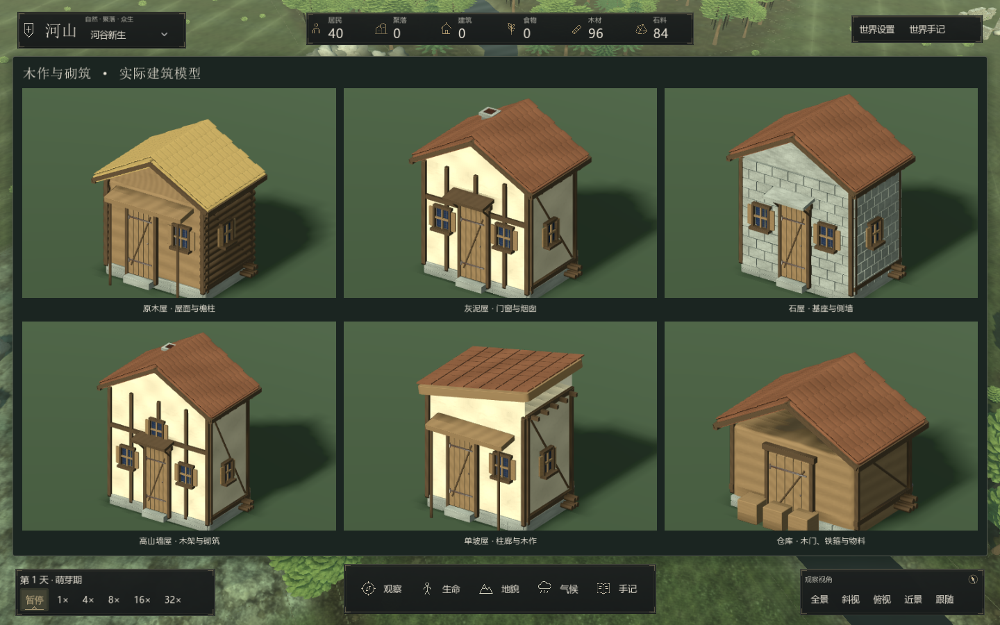
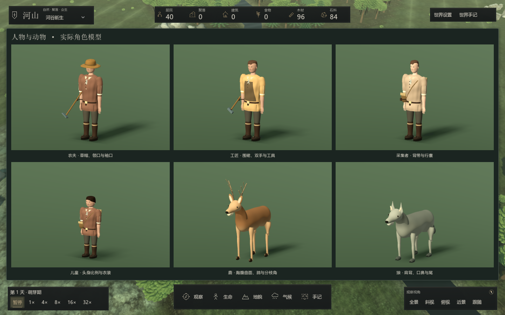
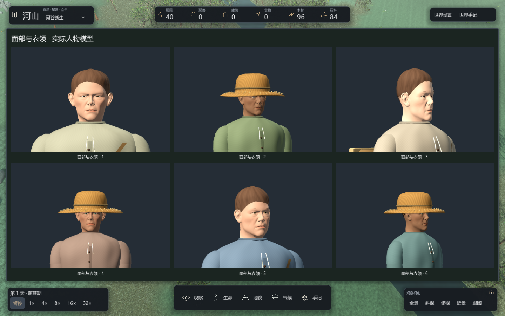
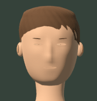
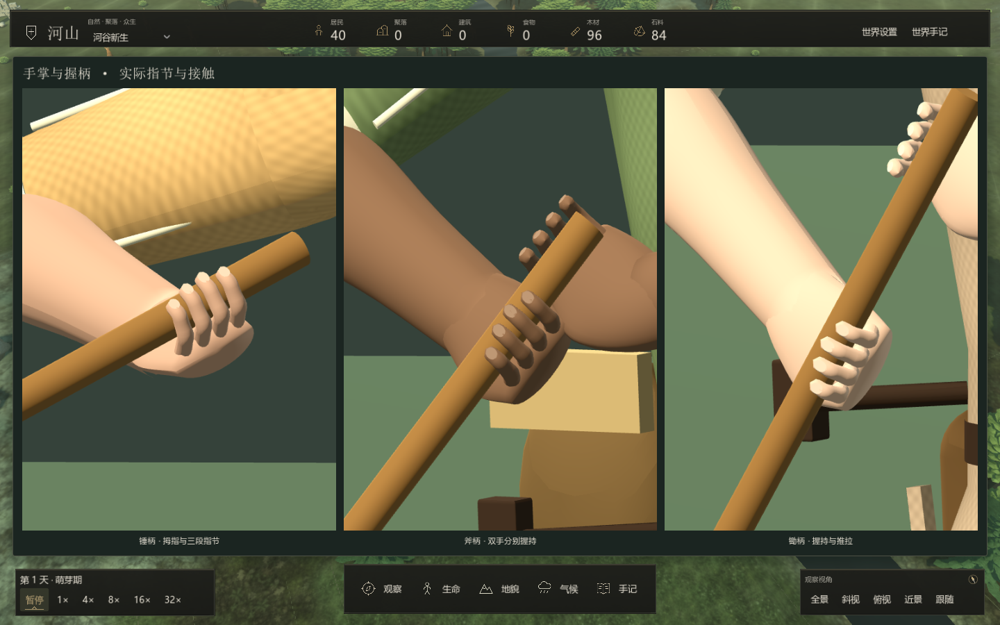
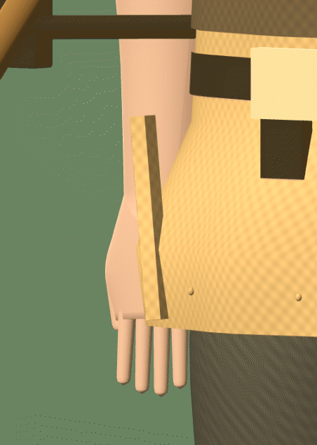
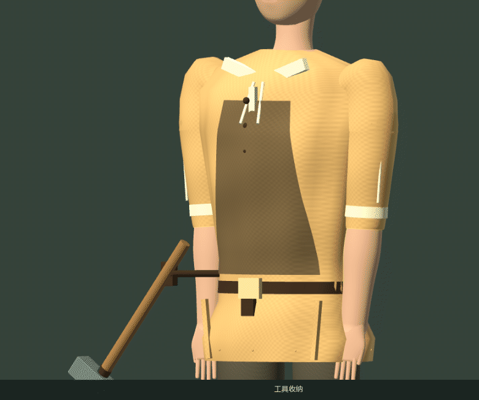
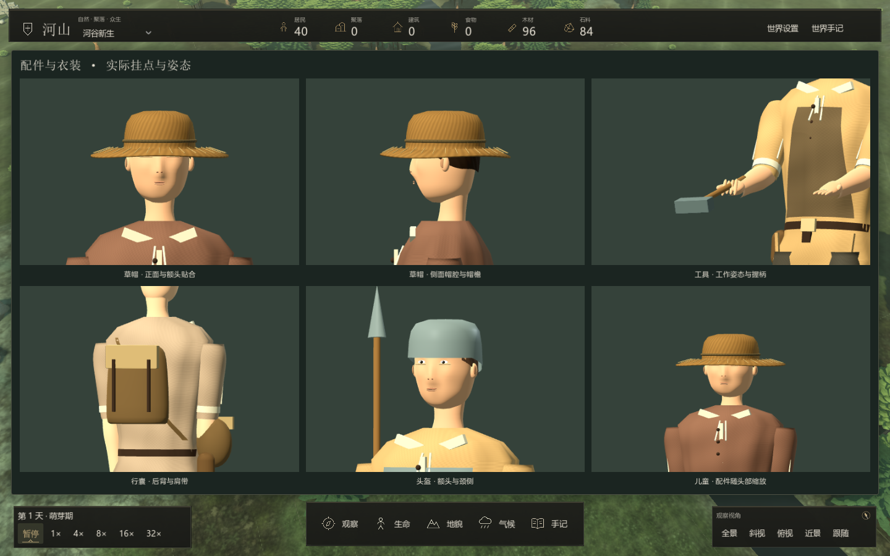
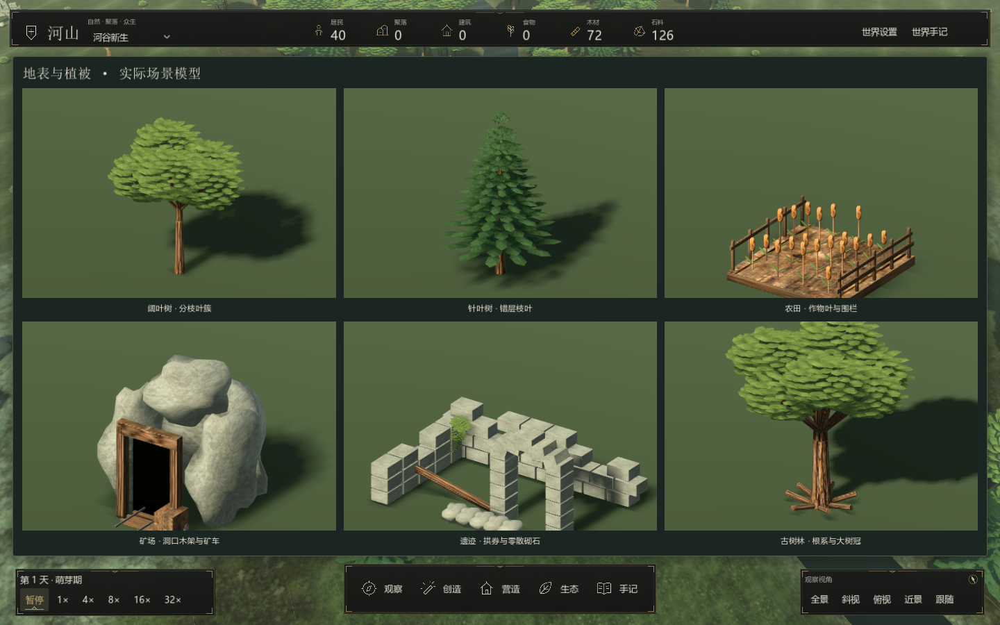

# 3D 模型系统

地图、人物档案和建筑图册使用同一套实际网格。模型由 C# 构造，材料图集与程序化表面结合；展示页不会生成模拟实体，世界存档仍保存居民、建筑与资源状态。

## 建筑

住房有原木屋、灰泥屋、石屋、高山墙屋和单坡屋五种轮廓。稳定身份决定宽深、楼高和变体；道路决定地图中的朝向。当前门洞、墙高和图册镜头按人物尺度重新调整，模拟建筑占地与通行规则沿用内核数据。

门由独立木板、门框、过梁、铁带和门闩组成；窗有外框、格栅、侧板和窗台。坡屋面有错缝分层瓦片、檐木和山墙边条；瓦片使用弧面截面，草束屋面带细小起伏与参差边缘。木作、瓦片和砌石具有浅倒角，门板有斜撑、铰链和铆钉，单坡屋有坡顶墙面。石屋与基础使用带细倒角的砌石，侧墙有木架；部分住房有烟囱、檐柱、木料与桶箍。

仓库保留宽门及门前物料；农田采用植株、叶片与通透围栏；矿场具有暗洞口、支架、轨道与矿车。未完工建筑使用基础、立柱、斜撑和材料堆。



## 人物与动物

人物头部具有连续面部曲面，衣装具有折线、领襟、袖口、缝线和腰带。手部包含掌形、手指与拇指；裤腿、靴筒及鞋底使用连续轮廓。职业配件、年龄比例、衣色和肤色继续由稳定身份和职业决定。肩肘、髋膝动作由表现层关节驱动。

鹿和狼使用独立的胸腹、肩背、颈部和头部截面，包含眼、口鼻、内耳、蹄或脚掌以及尾。鹿保留分枝角；狼采用尖耳和较低肩背。四条腿具有独立关节，移动时形成对角步态，停止时收敛到站姿；暂停停止关节变化。毛发表面按实际屏幕采样范围减弱细纹，避免远景噪点。



### 面部与肖像

人物耳部是带外缘与耳窝的曲面，埋入头部；皮肤保留局部顶点色与低对比表面变化，发丝材质随屏幕采样减弱细纹。人物头部使用较宽的下颌轮廓、连续面部截面、鼻梁和鼻尖、眼窝与颈部连接；眼睑可闭合，视线有小幅变化，进食和交谈有轻微唇部活动。眼窝、眼睑和嘴唇采样实际面部三角面；眼睛使用薄的杏仁形表面与虹膜着色，视线变化移动虹膜而不旋转整块眼窝，避免侧面凸出眼球。嘴唇是连续曲面与轻微中央唇缝，不叠加多条横线。肤色与眉眼对比保持较低饱和度，面部近景可使用 `--panel=faces`，独立预览不构成游戏目标或建筑委托入口。





## 配件与衣装贴合

草帽由双层帽冠、开孔帽檐、檐边、环绕缝带和编织表面构成，帽冠包住额头和头顶；头盔采用开放底部的壳体，并在耳后与颈侧延伸。它们挂在 `Headwear` 节点下，随头部的年龄比例、朝向与呼吸姿态运动。

围裙、护胸、腰带和斜背带从衣服的实际三角面采样，不再用浮在身体前面的矩形或直线替代。曲面层与衣服保留 4–6 毫米的表现间距。行囊通过 `PackMount` 贴合后背，采用圆角皮革轮廓、盖片与扣带。

近景衣身与衣袖的连接使用 `Skeleton3D`、三根绑定骨骼和逐圈权重，肩部圆顶与衣身合并到同一个蒙皮网格。连接根圈埋入衣身，末圈跟随上臂；前臂承担握持所需的扭转，上臂保持较小扭转，避免抬臂时露出断面或压扁肩部。内层肩部组织与双面衣料补足近景遮挡。

人物具有独立手腕、四指的三段指节、两段拇指和脚踝。工具通过 `HandGrip` 横穿合拢的手指，手部目标由肩肘两节逆运动学求解，肘部弯曲面跟随手掌而不是固定向后；左右手使用镜像握持朝向，支撑手跟随实际移动的手柄。作业轨迹与腰侧收纳角度使手掌和前臂保持较小夹角；徒手、搬运和进食允许手腕随前臂调整，避免强制世界朝向导致反折；俯身围绕髋部旋转，脚踝补偿小腿倾斜。工具在腰侧 `BeltToolLoop` 与手掌之间切换父节点，只在手已接触收纳位置并合拢手指后转移；放回先落位，再松开手指。每只近景手使用 16 根骨骼：掌部、四指各三节、拇指两节及前臂过渡。指节驱动连续蒙皮表面，腕部根圈随前臂运动，指根埋入掌形；不再直接渲染一串分离的胶囊。不同长度的手指分别配置闭合角度。手指截面在指节处带细小起伏，表面法线从实际几何重算。指甲曲面贴近手指表面，作为独立材质表面加入同一手部网格，绑定末节指骨，随手指运动；不增加悬浮挂件节点。检查包括各段指骨与变形后的手部表面，防止仅看指尖而漏掉中间指节穿柄。停止作业从当前姿态收回，而不是跳到固定准备姿势。

内核的采集动作可能在一个 tick 内完成。`PresentAction` 对实际 `Done` 状态补足一次有界的可见动作，避免渲染帧漏掉短暂的执行阶段；不重复采集或结算，不消耗模拟随机流。相同完成状态不会反复播放，新的行进、失败或紧急行为取消补播。补播与骨骼姿态只属于表现层，不写入世界存档。

工具与动作由真实的 `ActionKind` 和 `ActionPhase` 驱动，前往作业地点时可取出工具，到达后才开始作业；停止作业后收回。工具是表现层几何，不新增工具库存或改变作业收益。

| 真实动作 | 外观与动作 |
|---|---|
| 采伐木材 | 斧头、双手支撑与挥击 |
| 采集石料 / 铁矿 | 弯曲镐头、双手握持、蓄力与快速下击 |
| 耕种 | 长柄锄头、双手推拉 |
| 建造住房 / 农田 / 仓库 / 矿场 | 锤头、取出、抬臂、锤击与收回 |
| 采集食物 / 取回物资 | 俯身、屈膝、伸手与手指收拢 |
| 存放 / 分享 / 交易 | 双手递送 |
| 进食 / 饮水 | 手移向口部 |

木料束与物资袋根据居民的实际非零库存显示，代表主要携带资源，不按袋子数量计算库存。儿童不使用成人工具。近景独立指节参与握持，远景采用合并的手部、头部及覆盖肩部的静态衣装轮廓，近景与肖像保持完整曲面和指节；距离较远的人物降低姿态更新频率，根节点移动仍连续。近景手指只在闭合程度变化时提交骨骼姿态，删除已被蒙皮替代的胶囊网格节点，减少重复更新和隐藏节点开销。暂停冻结表现层动作，不推进模拟或随机流。









## 植被与地貌

阔叶树冠由带折面的叶簇构成，针叶树使用错层枝叶；树干有渐细与轻微弯曲。地图中的树干、枝条、冠层和岩石按 24 米网格分区批量绘制；每批保留自己的包围盒，镜头只绘制可见区域，保持原有植被几何和位置。古树林、野果地和遗迹复用同类叶片、石材与木材；岩石采用较低频轮廓变化，减少尖锐褶皱。表面保留低对比纹理、粗糙度与材质差异。



## 源码入口

| 文件 | 作用 |
|---|---|
| `NatureModels.Buildings.cs` | 建筑轮廓、屋顶与窗结构 |
| `NatureModels.ArchitectureDetail.cs` | 门、屋面搭接、砌石、支架与道具 |
| `NatureModels.Residents.cs`、`NatureModels.Tailoring.cs` | 人物衣装、四肢、手部与配件 |
| `NatureModels.Equipment.cs` | 帽壳、贴合衣装与背包挂点 |
| `NatureModels.HandTools.cs` | 工具模型、腰侧与手掌挂点、库存携带外观 |
| `NatureModels.HandSkin.cs` | 连续掌形、手指与腕部过渡的蒙皮网格和绑定 |
| `ResidentRig.cs`、`ResidentRig.HandPose.cs` | 真实行为呈现、收纳切换、肘腕求解、指节姿态与手部骨骼 |
| `NatureModels.Articulation.cs` | 连续蒙皮衣袖与肩部结构 |
| `NatureModels.Face.cs` | 贴合面部三角面的眼窝、眼睑、虹膜与连续唇部曲面 |
| `NatureModels.ResidentLod.cs` | 保留轮廓与肤发色的远景头部网格 |
| `NatureModels.HandlingValidation.cs` | 工具转移连续性、握持、作业、切换、携带与暂停检查 |
| `NatureModels.Sculpture.cs` | 连续头部曲面与布料表面 |
| `NatureModels.Animals.cs`、`AnimalRig.cs` | 动物解剖轮廓、材质与四足步态 |
| `NatureModels.Vegetation.cs` | 树冠、针叶枝层与树干 |
| `NatureModels.Craft.cs` | 平滑截面、倒角石块与连接构件 |
| `NatureModels.Surface.cs` | 木纹、灰泥、石材、屋面和植被的表面处理 |
| `NatureModels.RoofSurface.cs` | 弧面瓦片、草束起伏、边缘与封闭截面 |
| `NatureModels.CharacterSurface.cs` | 耳廓曲面、肤色表面和发丝着色 |
| `NatureModels.Validation.cs` | 曲面朝向、网格完整性、静态合并与关节检查 |

地图中的建筑同时缓存近景与远景网格；远景减少曲面细分和小构件倒角，保留同一屋面排布、轮廓与材质。进入 24 米以内切回近景，离开 32 米以外切回远景，避免在边界反复切换。模型图册始终使用近景几何。

新网格需要采用 Godot 的顺时针正面约定，并保持朝外法线。截面插值保留轮廓；不要仅提高球体细分来替代身体结构。静态部件按材质合并，动物和居民保留活动关节。建筑变体键限制到 140 个稳定组合，图册和地图共用缓存规则。

## 独立预览

先运行 `./tools/godot.ps1 -Mode build -Configuration Debug`，再通过 Godot .NET 可执行文件打开项目：

```powershell
& $env:GODOT_EXE --path src/SandBoxSim.Godot -- --panel=architecture
& $env:GODOT_EXE --path src/SandBoxSim.Godot -- --panel=characters
& $env:GODOT_EXE --path src/SandBoxSim.Godot -- --panel=equipment
& $env:GODOT_EXE --path src/SandBoxSim.Godot -- --panel=actions
& $env:GODOT_EXE --path src/SandBoxSim.Godot -- --panel=motion
& $env:GODOT_EXE --path src/SandBoxSim.Godot -- --panel=grip
& $env:GODOT_EXE --path src/SandBoxSim.Godot -- --panel=hands
& $env:GODOT_EXE --path src/SandBoxSim.Godot -- --panel=faces
& $env:GODOT_EXE --path src/SandBoxSim.Godot -- --panel=naturemodels
```

`--panel=person-hands` 打开真实人物档案的手部构图。`hands` 提供锤、斧、锄的握持近景；`faces` 同时展示正面与侧转面部。连续预览可使用 `--capture-frames=<绝对目录>`，输出 56 张 PNG，按 8 FPS 采样。录制时给引擎传入 `--max-fps 60 --quit-after 650`，留出启动和七秒录制时间；临时帧放在 `runs/screenshots/`，选定的正式配图放在 `docs/images/`。

这些参数仅打开开发用模型预览，使用固定灯光与同一套实际网格；普通游戏不会显示预览面板。原始素材来源见 [美术资源](assets.md)，界面操作见 [观察与界面](../guides/gameplay-observation.md)。

模型图册也提供无标题的评测裁切图及对象类别标签，入口与使用边界见 [评测接口与实验运行](benchmark.md)。

建筑表现按实体增量同步，共享合并网格并保留各自的位置与朝向；网格构造与缓存维护见 [性能采样与渲染维护](performance.md)。
