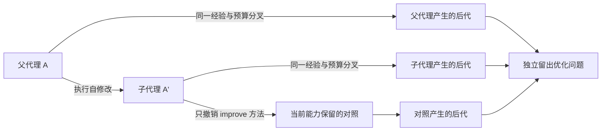

# 代理改进能力与程序性能

项目保留两条独立实验线：`efficiency.py` 测程序在相同结果下是否更快；`rsi_benchmark.py` 测代理修改后是否更会寻找优化、产生下一代，并把这种能力传递下去。程序加速是目标结果，不能单独当作 RSI。自修改代理的研究动机可参见 [DGM](https://arxiv.org/abs/2505.22954)；本项目的二阶、机制撤销协议是自己的操作性定义，不是该论文的复现或通用 RSI 认证。

## 核心实验

每轮先让父代理在开发问题上工作，再由父代理的真实进程输出子代理源码。评测器归档源码、调用输入/输出、耗时和 SHA-256；不是接受操作者手填的版本关系。下一轮实际执行这个子代理。

每轮使用全新的问题实例，开发数据与留出数据分开。代理只收到问题描述、开发反馈和经验；留出得分不进入后续提示。参考算法、评分器与工具文件固定。所有分组使用相同的尝试次数、单次调用和每题墙钟预算。

| 分组 | 用途 |
|---|---|
| 父代理 | 改进前的优化能力 |
| 子代理 | 自修改后的优化能力 |
| 撤销代码的父代理 + 新经验 | 区分代码变化与仅积累经验 |
| 冻结初始代理 + 同样经验 | 区分自修改与固定代理继续工作 |
| 父、子各自产生的后代 | 测量“产生改进”的能力变化 |
| 子代理撤销 `improve` 方法后产生的后代 | 保留当前优化能力，仅干预自修改方法 |

父、子及方法撤销组各做 3–5 次分叉。二阶区间同时重采样分叉和同任务族内的问题，避免只看一次成功生成。当前可干预组件是顶层 `improve(request)` 函数，它须自包含或使用父、子共有的绑定；复杂代理应把改进流程封装到这一边界。配置、模型权重或共享助手单独变化不等价于这个函数干预，不能据此声称已测所有 RSI 路径。



## 指标含义

`M(A)` 是代理在固定搜索预算内，找到正确且有效优化的能力：每次尝试只按开发集选择当前最佳候选，评测器在留出集计算其归一化收益，再对尝试轨迹求平均。越早找到可迁移的有效优化，`capabilityAuc` 越高；`successRate` 是最终留出收益至少 0.15 的题目比例。它们衡量优化过程，不是单个程序的 FPS。

| 输出 | 检验的问题 |
|---|---|
| `heldoutCapabilityGain` | 子代理在未见问题上是否比父代理更会优化？ |
| `codeInterventionEffect` | 撤销代码变化、保留新经验后，能力增益是否消失？ |
| `gainAgainstFrozen` | 是否胜过冻结初始代理的同预算工作？ |
| `offspringYieldAdvantage` | 子代理产生改进的增益，是否大于父代理产生改进的增益？ |
| `improverMechanismEffect` | 仅撤销自修改方法后，后代质量是否下降？ |
| `improverMechanismChanged` | 自修改方法的 AST 是否确实改变？ |

二阶量明确为：

`[M(子代理后代) − M(子代理)] − [M(父代理后代) − M(父代理)]`

`recursiveEvidenceSupported` 要求以上迁移、代码干预、冻结控制、二阶增益与方法撤销都通过，且自修改方法确实改变。默认筛选线是区间下界超过 0.02，至少 12 道匹配问题及 3 次分叉。代理更会优化，但改进方法没有变好，仍不能通过这一判定。0.02 是预声明的实验筛选线，不是普适科学阈值。

进程调用次数、输入/输出字节、实际墙钟时间和超时独立记录。模型 token、供应商版本及权重身份没有独立认证；不能把字节数叫作 token，不能把源代码哈希叫作模型身份。

## 启动与代理协议

无需 Godot；环境为 Python 3.10+。先运行显式标记的非 LLM 夹具：

```powershell
python tools/rsi_benchmark.py run benchmarks/rsi-meta-smoke.json --output runs/meta-demo
python tools/rsi_benchmark.py verify runs/meta-demo
```

夹具故意让第一轮仅改善优化能力，第二轮再修改生成下一代的方法，用来验证普通收益与二阶、因果收益不会混为一谈。`fixtureOnly: true` 的输出不是实际模型 RSI 结果。

代理是单个 UTF-8 Python 文件，通过 stdin 接收 JSON，stdout 只返回一个 JSON 对象，并提供顶层 `propose(request)` 和 `improve(request)`。`propose` 收到公开问题、开发反馈、经验与预算；返回：

```json
{"proposal": {"strategy": "by_kind"}}
```

`improve` 收到当前源码与开发经验；返回完整下一代源码：

```json
{"successorSource": "...完整 Python 源码..."}
```

示例见 [scripted_improver.py](../../benchmarks/agents/scripted_improver.py)，配置见 [rsi-meta-smoke.json](../../benchmarks/rsi-meta-smoke.json) 和 [配置 Schema](../../benchmarks/rsi-meta.schema.json)。使用真实模型时，把模型调用、诊断、候选构建和改进逻辑放入自己的代理文件；仅通过配置中的 `envAllowlist` 转交所需环境变量。新源码语法、大小、实际调用与父链都会检查；超时、非法回复或非法自修改保留失败产物，不接受正向 RSI 结果。不能只发布成功重试而隐藏失败运行。

程序在普通本机进程中运行，使用墙钟和输出上限，不是操作系统安全沙箱。当前适用于可信本地代理；文件哈希发现评分器误改，不是防恶意代码的签名或容器隔离。

## 两种任务后端

`kernel` 是可审计的沙盒派生问题：资源索引、四邻域寻路和可视状态增量更新。代理在评分器拥有的策略集合中选择；结果与工作量由评分器计算，代理不能自报工作量。工作单位是约定的搜索/更新操作代理量，不是 CPU 时间或能耗。这条线验证代理搜索与改进机制，策略空间很小，不应包装成广泛代码生成能力的排行榜。

`http` 接入真实 C# 内核优化。代理返回 `{"proposal":{"endpoint":"http://127.0.0.1:8767"}}`，评测器调用现有配对效率工具，核对完整状态、独立寻路判题与完整运行成本。候选必须事先通过代理/控制器构建并启动，生命周期由该控制器管理。

HTTP 配置使用 `backend: "http"` 和 `httpStages`，每轮含 `training` 与至少 12 个 `probes`；每个问题指定 `id`、`reference`、`description`、`developmentSuite`、`heldoutSuite`，可提供 `workspace`。套件路径相对配置文件，所有开发/留出种子跨问题、跨轮次不得重复。套件定义见 [在线性能说明](online-efficiency.md)，配置结构见 [Schema](../../benchmarks/rsi-meta.schema.json)。留出套件的内容不会作为代理请求输入；真实研究还须由可信控制器隔离候选进程与这些文件。

输出包括 `agents/`、逐调用 `calls/`、`stage-*.json` 和 `result.json`；失败时保存 `failure.json`。验证器重算候选轨迹、分叉汇总和干预得分，并核对实际进程输出与归档后代源码。跨版本源码变化后不能拿旧报告冒充本版验证。

## 程序加速仍独立检验

`efficiency.py run` 继续做真实程序性能对照；`experiment`/`rounds` 继续整理性能历史。其输出现为 `optimization-history-v2`，原先误命名的 `recursiveImprovingRounds` 改为 `sequentialRuntimeImprovingRounds`，并明确 `rsiClaim: false`。多轮程序加速只是性能历史。

在线观察按世界版本缓存状态、地图与编码后的 JSON，修改/推进/重置前失效；只读查询没有后台时钟。Python 客户端每线程复用 HTTP 连接，不使用代理、不跟随重定向，也不对状态修改做含糊自动重试。

完整观察工作负载的对照工具为：

```powershell
python tools/observe_benchmark.py --reference reference/SandBoxSim.Console.dll --candidate candidate/SandBoxSim.Console.dll --repeats 9 --output runs/observe-pair
```

它包含建图、20 tick、重复状态读取、两次地图读取和释放，验证观察内容与摘要一致。`--reference-client-file` 可同时比较保存的旧客户端；输出分别记录两个客户端和服务程序集哈希，区分服务端收益与整体传输收益。这不是游戏帧率或模拟 tick 吞吐的测量。
