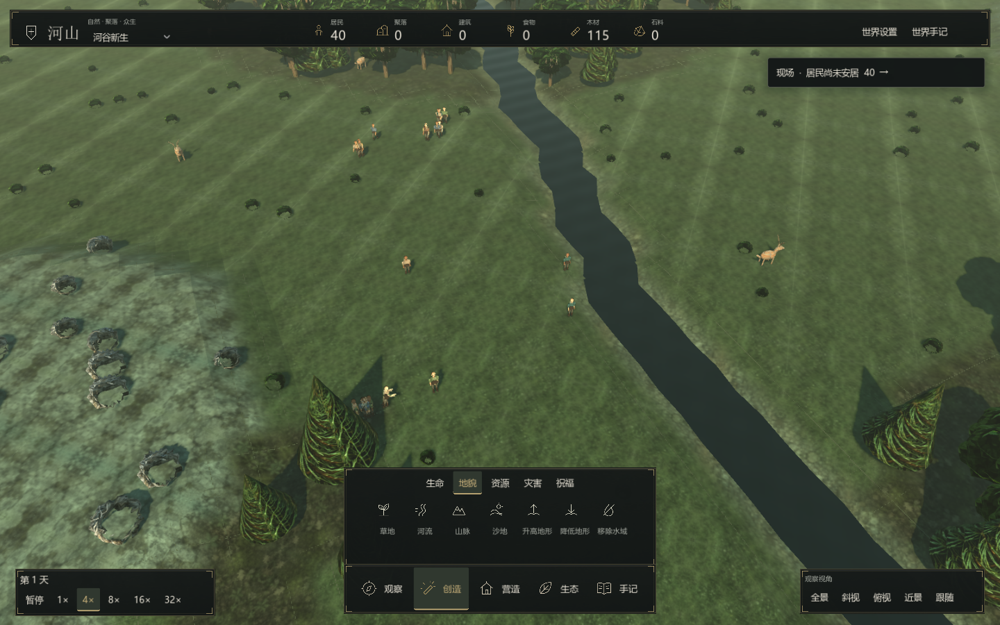

# 观察与界面

界面参考《庄园领主》的顶部概览与底部操作结构，使用石墨绿灰底、低对比皮革纹理、旧铜边角和象牙白文字。顶部以细线图标展示人口、聚落、建筑及已采集储备；底部的时间、主操作与镜头分为三个紧凑区域，保留区域之间的地图视野。详细手记按需打开，创造工具以底部菜单展开，观察模式收起菜单以保留世界视野。

## 人物与动态反馈

人物页以紧凑档案呈现：小幅 3D 肖像与姓名、年龄和职业并列，下方显示需求与故事。肖像使用与地图相同的居民模型；拖动平滑旋转，滚轮查看衣领、面部和职业配件，操作只影响肖像。独立场景采用中性暗底与柔和主光、侧向轮廓光，人物切换沿用稳定身份。

居民的衣服、肤色和体量具有确定性差异；儿童采用不同身体和头部比例。采集、建造、耕种与职业配件共同形成可观察的外观。地图中的肩肘、髋膝关节表现行走、劳动与休息，暂停冻结动作；肖像保留轻微呼吸，作为人物展示。

按钮在悬停和按下时平滑反馈，打开面板使用短暂淡入和缩放，需求条平滑过渡到实际数值。重复打开会中止上次过渡，避免动画堆积。视觉动画不推进内核、不消耗模拟随机流。

## 建筑图册

聚落营造中的住房、仓库、农田与矿场使用真实 3D 模型卡片，标明材料费用。悬停时模型缓慢转向，移开后恢复展示角度；选择后，左侧放置面板展示同类建筑与落点条件。图册使用独立场景与镜头，不生成世界建筑，也不改变人口、资源或随机流。静止预览保留已渲染图像，仅在模型变化、显示或转向时重新绘制。实际住房仍由稳定身份决定变体，卡片展示的是代表性样式。

## 镜头与控制

顶部提供场景选择、人口概况、已采集储备、设置和手记入口。底部的“创造”展开干预分类与工具，“营造”“生态”直接进入对应页面；日期、时间与镜头预设位于底部两侧。观察模式左键拖动平移、右键拖动旋转与俯仰、滚轮缩放；单击选择，F 返回全景，空格暂停或恢复。

干预工具保留左键连续绘制，中键可在任何工具下平移。工程、建筑和蓝图落点可左键拖动调整视野，松开不会误建；Esc 取消。释放鼠标或切出窗口解除拖动。

## 理解世界

| 入口 | 观察内容 |
|---|---|
| 现场提醒 | 实际火情、疾病、饥饿、缺水和住房风险，以及对应定位 |
| 小地图与图层 | 实际地图、资源、水土、人口、路径与工程区域 |
| 人物页 | 需求、库存、行为目标、住址、关系与人生记录 |
| 历史与曲线 | 世界事件原因和每日人口、资源等变化 |
| 工程图册 | 工程作用、范围、建设时间和费用 |
| 土地管理 | 当前条件、政策、维护结果与冻结完工对照 |
| 聚落营造 | 建造材料与落点要求，蓝图中心与真实进度 |

人口规模和地表存量不能单独解释一个人的处境。把人物行动、仓库库存、路径和每日变化结合起来，才能区分短期救助与持续改善。所有观察界面读取实际状态。

## 世界反馈

真实天气与模拟日间进度驱动光照、太阳角度和雾气。地表采样混合不同 mip 层，减少近远景重复纹理；大尺度明暗变化保留地形层次。河水使用深绿灰底、视角相关的亮度及两组动态波纹。火灾、疾病、施工、土地工程和蓝图区域有独立反馈；事件提示圈限制数量并快速淡出，详细记录保存在历史页。

工程插画说明主题，地图、人物和建筑由真实场景表现。素材来源见 [美术资源](assets.md)，规则关系见 [世界系统](world-systems.md)。

## 储备数值与参考

资源栏统计存活居民背包、地面物资堆与仓库中的食物、木材和石料，不包含尚未采集的地表资源。总量不代表每个居民均可到达物资，定位和个人库存仍需结合检查。

界面构图参考：[《庄园领主》官方界面指南](https://wiki.hoodedhorse.com/Manor_Lords/Beginner%27s_Guide)。项目材质、模型与图标说明见 [美术资源](assets.md)。
