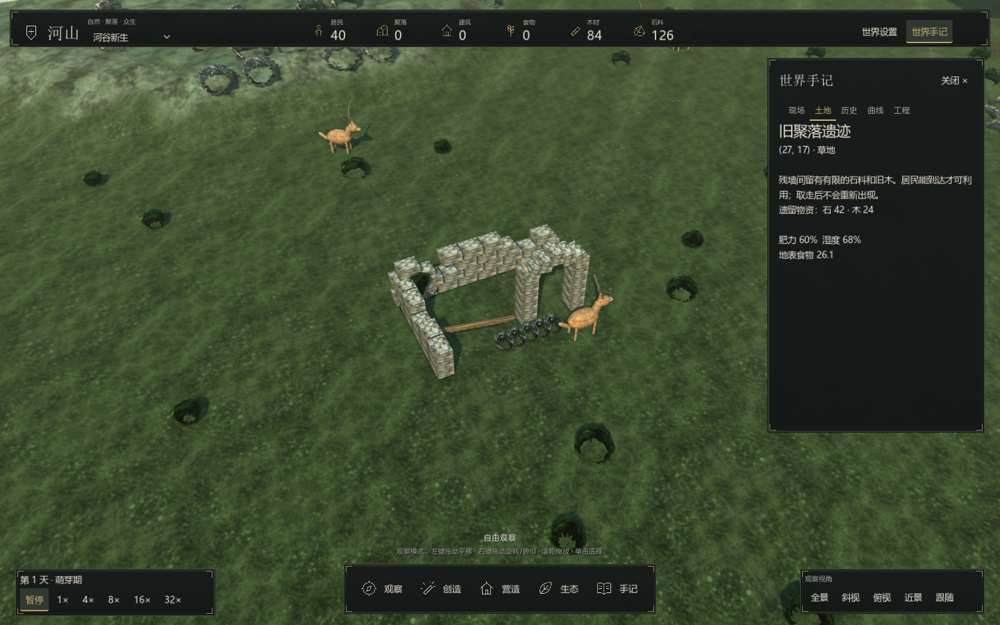
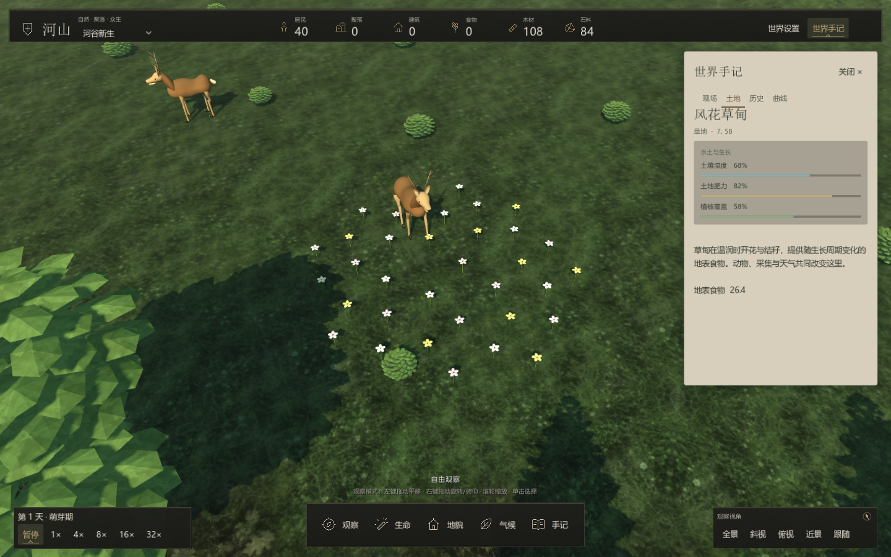

# 自由探索与荒野

世界可以自己生长，也可以被改变。泉水、林木、材料和居民的分布会产生不同的生活条件；没有规定城镇模板、发现数量或通关目标。

## 可遇见的地方

新建图形世界由种子分布最多十五处特殊地貌。它们有可见的 3D 轮廓，不在任务列表中逐项标出。单击附近土地，详情显示当地作用、资源与是否受损。

| 地貌 | 实际作用 | 变化 |
|---|---|---|
| 苔石泉 | 水域中心，每个日界涵养周围三格内适用土壤 | 填平泉眼、改变中心或占用后停止补水 |
| 野果洼地 | 水分、肥力和植被足够时，补充草地食物节点 | 生长周期影响结果；干旱、火灾或改造可能停止 |
| 古木林 | 有林木和植被时留住部分土壤水分，木材来自真实节点 | 伐林、火灾和建造会改变作用 |
| 旧聚落遗迹 | 留有一次性的石料与旧木，进入真实地面物资堆 | 居民可达才可利用，取走后不会刷新 |
| 赤土岩脉 | 周边分布铁矿与石料，矿产节点不可再生 | 需要实际采集；矿场仍遵守材料和劳动规则 |

天然作用避开既有建筑、道路、水域、矿地和火情，不强制把玩家改造的土地重新改回原状。遗迹材料可以被居民利用，也可能仍因距离和路径而无人取走；没有点击领取的奖励按钮。

## 时间与生态

野果地每十二天更换一次阶段，四个阶段构成四十八天的循环：萌芽、丰盛、落叶、休眠。前三阶段在满足条件时补充不同数量的食物，休眠阶段不额外结果。原有资源再生、天气和采集仍继续运行；这是荒野结果周期，不是对整个世界强制切换气候。

泉眼补水、古树林保水与野果增产都是逐日的局部作用。地块上的建筑、燃烧、植被、湿度和肥力会改变结果。地表食物和矿产不会直接进入顶部储备，需要居民获得。

## 自己的地点手记

单击任意土地，在“现场”页输入自己的名称并点击“记下”。也可不输入名称，使用当地地貌名称或坐标。已记地点可以重新命名、定位或通过 × 移除。手记只保存你主动记下的地方，没有探索百分比。

名称最多二十四字，最多保留三十二个地点。它们与世界一起保存；回溯保留快照当时的地点。镜头定位和读取描述不推进世界或改变随机流。

## 世界与保存

新建图形世界生成荒野地貌。旧档缺少 wild 数据时保留原地图，不在已发展区域插入新地点。载入和回溯忽略旧版试炼、蓝图和工程队列元数据，保留已经形成的地形、人口、建筑和资源。新存档不再写出这些目标与队列。

地图、资源和遗迹物资属于核心存档；地点、自然日界进度和命名手记属于图形会话元数据。Console 可以运行核心状态，但不会推进这些额外的荒野作用，见 [存档与确定性](../development/saving.md)。

## 花甸、苇泽与倒木林隙

花甸在温润且有植被时随周期开花、结籽，额外食物量低于野果地；休眠停止额外结籽。苇泽以湿地为中心，缓慢增加附近土壤湿度，填平或烧毁会停止作用。

倒木林隙提供一次性的 48 单位木料。木料尚存时朽木缓慢提高附近肥力，取尽后停止这项作用；不会再次发放木料。三类地点有独立模型，没有发现计数、领取奖励或完成目标。

