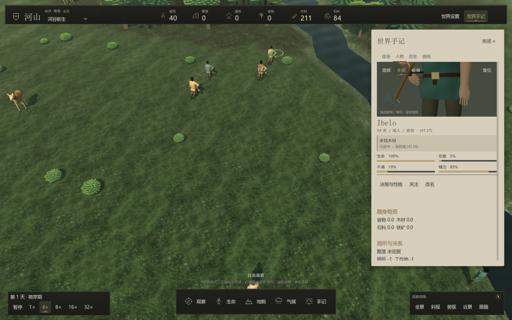
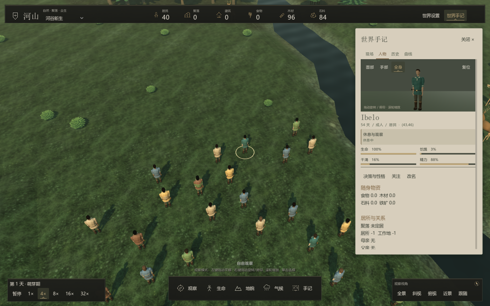

# 观察与界面

界面使用统一炭灰面板、无衬线标题、浅色文字和暖沙色强调；区域地图使用相同的深色信息底。圆角、细边线与柔和阴影区分面板层次。世界铺满窗口，手记按需展开；底部时间、自由工具与镜头分区。没有任务栏、住房委托卡片或工程阶段页。

## 人物与土地

人物页以横幅近景肖像、姓名、年龄与职业呈现居民，需求条显示实际状态。决策与性格、关注和改名集中在一行；点击“改名”才展开输入框，命名后收起。资料内容可以整页滚动，关系、物资和个人历史不会被限制在底部的小区域。动作卡显示居民正在做什么、执行阶段与目的地；肖像同步呈现这个实际行为。短暂的采集完成后会补足一次拿取或工具动作，状态卡标记“动作收尾”；这不会重复产生资源。人物会眨眼、轻微调整视线。全身观察中的工具握持包含接触后合拢和放回后松手；左右手分别握柄，搬运时物资保持直立。肖像上方“面部 / 手部 / 全身”切换构图；手部视图跟随实际双手位置，方便查看拿取和握柄。左右拖动旋转，上下拖动俯仰，滚轮平滑缩放；双击画面或点击“复位”恢复当前构图，不影响地图镜头。

手记宽度随窗口调整，人物肖像默认更靠近面部，紧凑面板保留 204 像素逻辑高度，并以匹配比例的独立视口渲染；资料仍整页滚动。Esc 先关闭世界设置，再关闭手记；没有展开面板时退出当前工具并收起工具栏。按钮可通过 Tab 获得焦点，悬停与键盘焦点都有可见反馈；世界设置关闭“界面动态效果”后，过渡立即完成。

人物头部采用连续截面，具有圆润下颌、鼻梁与鼻尖、眼窝、贴合面部的五官和颈部连接。

土地页展示湿度、肥力、植被与资源，现场页保留玩家自选地点和世界故事。历史与曲线记录实际变化，没有完成百分比。

## 交互反馈

按钮悬停、页签切换、面板展开和数值变化有短暂过渡。设置可关闭柔和界面动效，偏好保存在本机 `user://interface.cfg`；视觉过渡不推进内核、不消耗模拟随机流。

顶部世界信息、资源和菜单分组悬浮；选中的时间倍率和工具使用克制的底色及暖色细线，悬停与键盘焦点通过底色反馈。手记使用统一深色面板和浅色文字，导航图标为 16 像素，详情标题和图标随人物、动物或土地选择切换。小地图标出选中位置，悬停显示坐标与定位环，单击可定位。

镜头支持鼠标平移、旋转、俯仰与缩放，小罗盘随真实视角变化。操作见 [玩家手册](player-guide.md)。

## 世界呈现

单击住房后，手记显示独立生活状态卡：实际住户人数、建筑完整度细条和空置状态。单击有地面物资的土地可查看精确库存，世界中的物资堆同步反映数量档和取空。这些信息来自当前世界，不生成住房委托或发展目标。

住房与物资所在格优先显示土地页；住房卡支持转入建筑近景和打开住户档案。施工中显示进度，空地不会保留空的住房卡背景。人物档案中的镜头操作继续独立使用。

现场页将所选土地的水分、肥沃度与活动压实显示为三组分色读数和细条，数值直接读取当前土地。地面库存使用独立物资卡，仅显示存在的食物、木材、石料或铁矿；数量与世界物资模型来自同一库存记录。

天气与日间进度驱动光照和雾气。地表采样保留近远景层次，水面有细波纹；火灾、疾病和人物行为有视觉反馈。房屋、人物、动物与植被使用实际 3D 网格，详见 [模型系统](../development/models.md)与[美术资源](../development/assets.md)。

顶部资源栏统计居民携带、地面物资堆和仓库，排除未采集的地表资源。总量不代表每位居民都能到达相应物资。

人物详情摘要去除前导空白，全身构图可与实际身份、需求和关系同时观察：

---

[文档导航](../README.md) · [项目首页](../../README.md)
