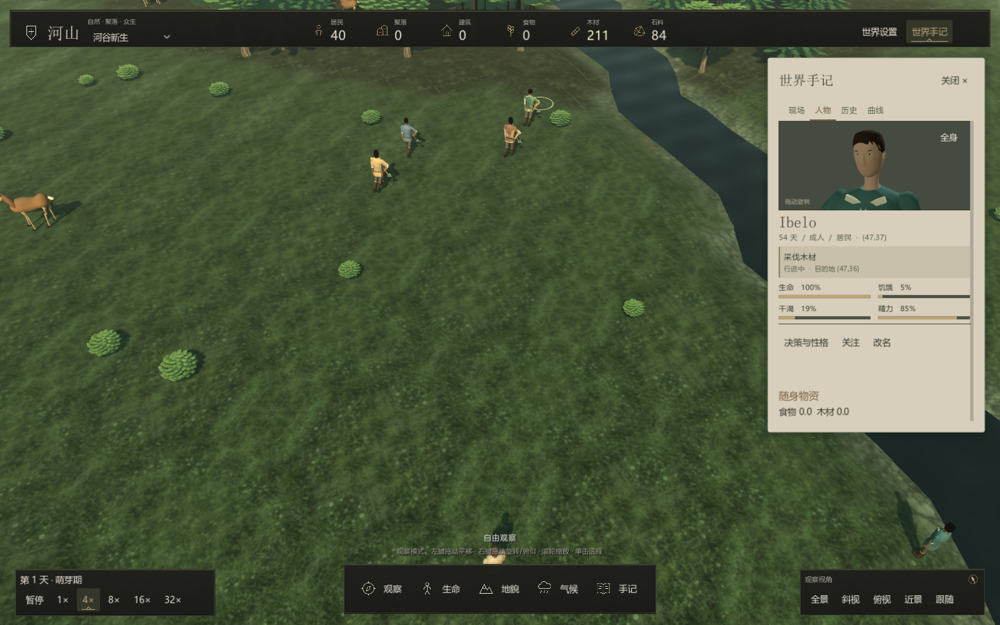

# 观察与界面

界面使用暖纸色田野手记、石墨色工具栏、低饱和铜色与清晰文字。世界铺满窗口，手记按需展开；底部时间、自由工具与镜头分区。没有任务栏、住房委托卡片或工程阶段页。

## 人物与土地

人物页以横幅近景肖像、姓名、年龄与职业呈现居民，需求条显示实际状态。决策与性格、关注和改名集中在一行；点击“改名”才展开输入框，命名后收起。资料内容可以整页滚动，关系、物资和个人历史不会被限制在底部的小区域。动作卡显示居民正在做什么、执行阶段与目的地；肖像同步呈现这个实际行为。短暂的采集完成后会补足一次拿取或工具动作，状态卡标记“动作收尾”；这不会重复产生资源。人物会眨眼、轻微调整视线。全身观察中的工具握持包含接触后合拢和放回后松手；左右手分别握柄，搬运时物资保持直立。点击肖像右上角“全身”观察握持和作业，再点击“面部”恢复近景。拖动肖像旋转，滚轮缩放，不影响地图镜头。人物头部采用连续截面，具有圆润下颌、鼻梁与鼻尖、眼窝、贴合面部的五官和颈部连接。

土地页展示湿度、肥力、植被与资源，现场页保留玩家自选地点和世界故事。历史与曲线记录实际变化，没有完成百分比。

## 交互反馈

按钮悬停、页签切换、面板展开和数值变化有短暂过渡。设置可关闭柔和界面动效，偏好保存在本机 `user://interface.cfg`；视觉过渡不推进内核、不消耗模拟随机流。

镜头支持鼠标平移、旋转、俯仰与缩放，小罗盘随真实视角变化。操作见 [玩家手册](player-guide.md)。

## 世界呈现

天气与日间进度驱动光照和雾气。地表采样保留近远景层次，水面有细波纹；火灾、疾病和人物行为有视觉反馈。房屋、人物、动物与植被使用实际 3D 网格，详见 [模型系统](../development/models.md)与[美术资源](../development/assets.md)。

顶部资源栏统计居民携带、地面物资堆和仓库，排除未采集的地表资源。总量不代表每位居民都能到达相应物资。
