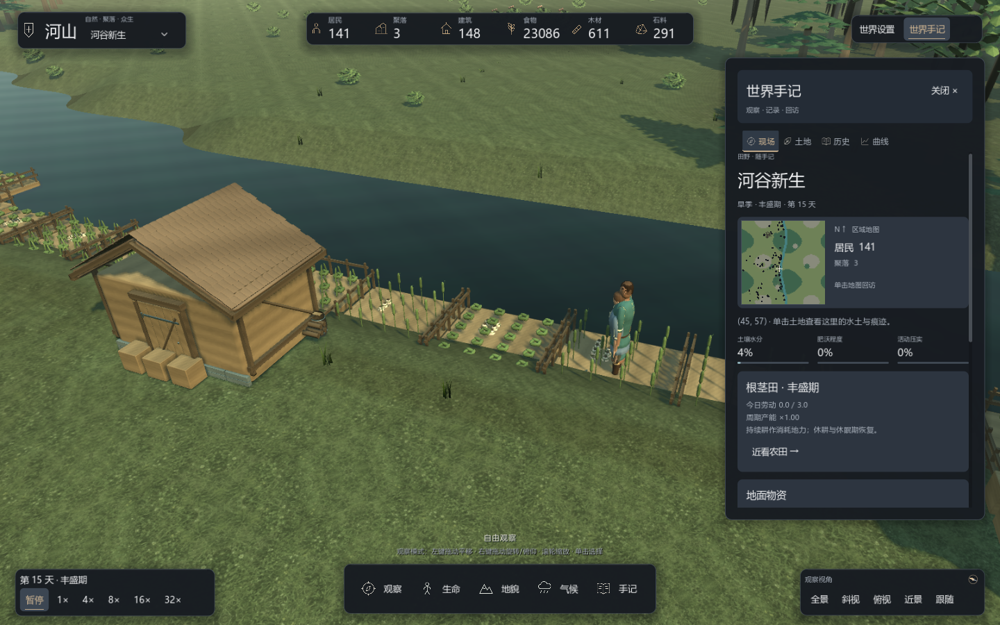

# 农业、地力与食物流动

河山的农田参与世界的长期变化。居民自主开垦、耕作和寻找物资；玩家可以改变水土、资源或居民分布，观察作物、土壤和储备的连锁反应。界面不提供农业委托、发展路线或必做目标。

## 三类作物与周期

农田按世界种子和位置稳定派生为谷物、根茎或豆科；存读档和观看不会重新抽取作物。一个生长周期为 48 天，每 12 天进入萌芽、丰盛、落叶或休眠阶段，与世界的自然周期使用同一时钟。

| 作物 | 萌芽期 | 丰盛期 | 落叶期 | 休眠期 | 土地与天气特性 |
|---|---:|---:|---:|---:|---|
| 谷物 | 0.45 | 1.00 | 1.65 | 0.15 | 集中产出，耕作消耗地力 |
| 根茎 | 0.80 | 1.00 | 1.25 | 0.45 | 产出更平缓，干旱天气惩罚减轻 |
| 豆科 | 0.60 | 1.20 | 1.05 | 0.20 | 有劳动投入时帮助恢复地力 |

表中是周期乘数，实际日产量还乘基础产量、地力、水分、天气、劳动与文明生产因子。三类作物最终进入现有食物库存；居民使用已有耕种动作，日产量在日界结算。农民评估作物当前产能，选田时综合产能与距离，休眠期不再和高产期使用完全相同的工作偏好。

近景显示谷穗、根茎叶丛与豆荚，各有四阶段形态。现场页显示实际作物、阶段、当天劳动和周期产能，并支持近看农田。界面读数本身不推进生产。

## 累积地力

每日劳动强度以当天劳动量除以劳动上限归一化。谷物与根茎耕作默认按强度消耗最多 0.012 地力；豆科耕作默认恢复最多 0.007 地力。没有劳动或进入休眠阶段时，恢复量受水分影响，为恢复率的 30%–100%。地力限制在 0–1，持续利用的后果逐日累积。

地力在产粮后更新，不追溯改变刚结束一天的产量。干旱减产、休耕恢复和居民改选田共同影响后续资源供应；玩家可通过现有地貌与气候工具观察这些变化。

## 地面食物与仓储

地面食物每日按基础腐损率 0.025，乘 `(0.5 + 温度) × (1 + 0.2 × 水分)` 损失一部分。被移除的真实食物在适合的、未燃烧土地上缓慢增加肥沃度：每单位腐损贡献 0.0005，单格每天最多增加 0.02。铺装道路、水域、山地和熔岩不获得这种土壤反馈。

仓库中的食物受现有容量约束，并受到存放保护；木材、石料和铁矿不按食物腐损规则扣除。居民仍需要到达物资，仓库满时农田产出转到地面。生产统计只计入实际接收的数量，满地面堆未接收的产量不会冒充库存。

## 配置、保存与研究

`Buildings.LivingAgricultureEnabled` 默认开启。相关参数为 `FarmSoilUsePerDay`、`FarmSoilRecoveryPerDay` 与 `GroundFoodSpoilagePerDay`；关闭总开关后使用传统周期系数，不进行新增地力反馈与腐损。库存和地力沿用存档状态，作物与阶段由种子、位置、时钟派生，六项内核测试检查周期、土壤、仓储保护、关闭规则、容量与日界保存恢复。

新增配置会改变配置指纹和旧世界的后续演化，旧样本的摘要或成本不能直接作为新规则的基线。研究适配器可通过 Core 观察这些状态，HTTP 世界步进执行同一内核规则。`sandbox-living-economy-smoke.json` 把六项语义检查接入真实源码研究，开发与留出世界跨越日界；该夹具用于接口和状态回归，不是已验证的模型 RSI 能力。

2026-10-08 全部 370 项内核测试通过，图形自检覆盖二十四种作物近远景组合。真实研究夹具执行两次源码提案，保留一次预期编译失败，第二个候选通过包含六项农业测试的检查以及三种留出世界；全流程约 26.05 秒，留出未确认效率改善。归档为 `runs/evaluation/living-economy-research-delivery-20261008`，失败的早期快照与场景配置实验独立保留。

---

[玩家指南](player-guide.md) · [聚落与居民](settlements.md) · [真实源码研究](../development/sandbox-research.md)
