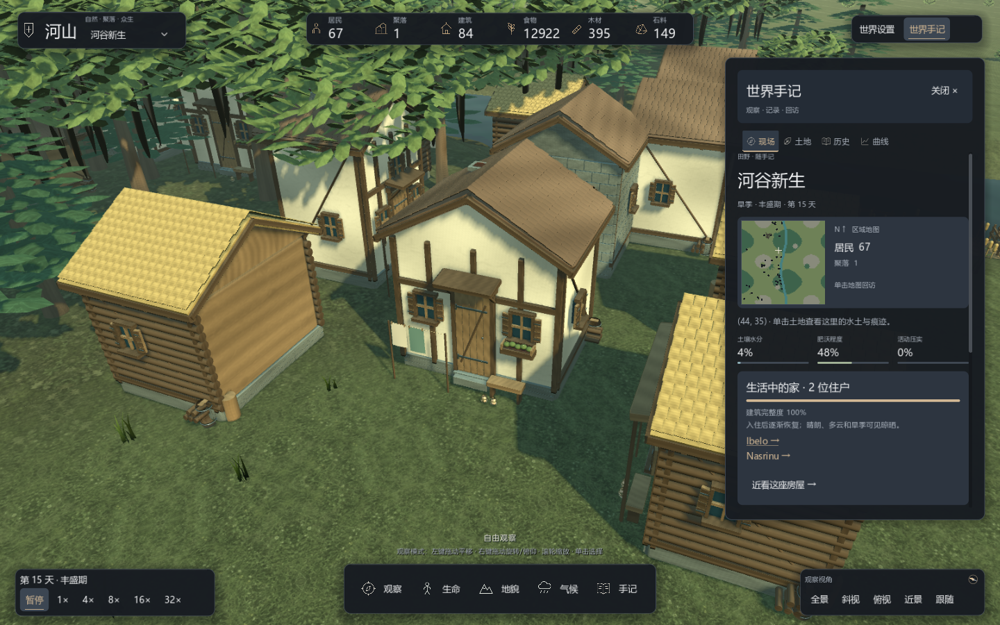

# 聚落与居民

建筑由居民自主选择和施工，客户端不提供住房委托、建筑落点安排或蓝图目标。玩家通过改变世界条件观察聚落的发展，不需要遵循规定路线。

## 建造与生活

居民根据自身需求、职业、资源和可达性决定行动。住房提供床位，仓库存放物资，农田与矿场参与生产；施工使用真实材料，不会因玩家打开界面而自动完工或搬入。

住房外观由稳定身份形成五种轮廓，并结合宽深、楼高、门窗、材质与附近道路朝向。原木屋、灰泥屋、石屋、高山墙屋和单坡屋共享内核规则；外观不替代材料和通行状态。

完工住房的近景细节读取实际住户人数：门前出现长凳、陶器与晾晒架。晴朗、多云和旱季显示晾晒，雨雪天气收起；布料上缘固定在绳上，下摆有轻微风动。空置房屋没有这些生活物件。建筑完整度下降后出现表面痕迹，严重风化时增加支撑木。

维护沿用现有模拟：启用建筑衰败时，有住户的住房按每日衰败率的两倍恢复，无人使用的住房在宽限期后衰败。表现层不新增修缮工作、消耗材料或扩充床位。单击住房后，世界手记显示实际入住人数与完整度。

普通观察模式单击房屋或地面物资会优先打开土地页，附近居民不会抢走选择。住房卡中的“近看这座房屋”按房屋实际朝向调整镜头，住户姓名链接打开该居民的档案；住户列表读取当前居民的住处记录。施工阶段显示实际施工进度，关闭建筑衰败的世界会注明相应配置。雨雪天气只收起衣物，晾晒架继续保留。

地面的食物袋、木料和矿石堆对应已采集库存，按数量显示三个规模档；被取空后消失。它们不代表尚未采集的地表资源，精确数量在选中土地的手记中查看。

## 观察社会变化

点击居民查看需求、当前行为、库存、住处与家庭关系。关注和镜头跟随使用稳定身份，存读档后继续有效；居民去世后保留档案与历史。

建造、婚姻、出生、迁徙、贸易与聚落变化会形成记录。手记和图层只读取实际世界，不为玩家生成发展任务。

模型近景与结构说明见 [3D 模型系统](../development/models.md)，世界操作见 [玩家手册](player-guide.md)。

## 资源目标与紧急进食

农业新增三类作物、生长周期、耕作地力反馈与地面食物腐损，居民选田考虑距离和当前产能。具体规则、现场页和存档说明见 [农业、地力与食物流动](living-economy.md)。

居民按稳定的附近区块顺序找资源，在候选格中排除不可通行或与当前位置断开的地点。一个区块没有有效目标时会继续查看其他区块；岸边取水点也检查可达性。地形、通行或道路变化会使派生连通缓存失效，因此新打开的通道可以被后续决策使用。这是局部可达搜索，不是全地图最短成本规划。

正在赶路的居民，饥饿达到 85% 且携带至少一份食物时，可以停下赶路进食，正在执行的工作步骤先完成，避免取消尚未结算的劳动；当前逃跑、攻击、进食或饮水不会被此规则打断。普通工作仍保持原来的决策冷却和分批次更新。决策记录会显示实际选择的进食行为。

## 聚落周边的土地

反复使用的行走和采集区域会累积压实，影响植被与再生；建筑占地和铺装道路不积累普通脚步压实。住房形态与这些土地状态分别保存和显示，模型变化不会改变床位或造价。长期影响见 [地形与活动痕迹](terrain-and-traces.md)。

---

[文档导航](../README.md) · [项目首页](../../README.md)
