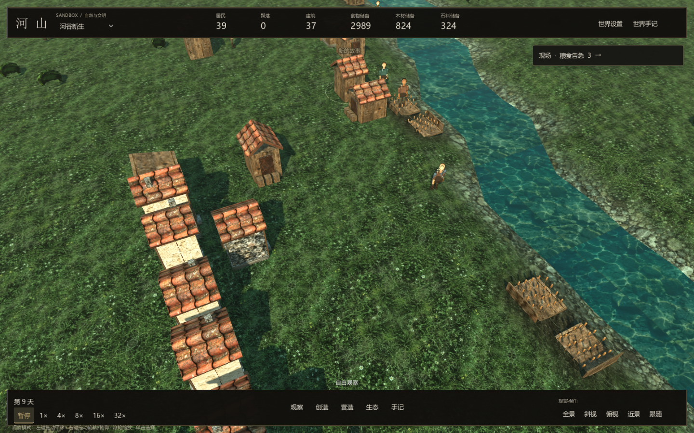
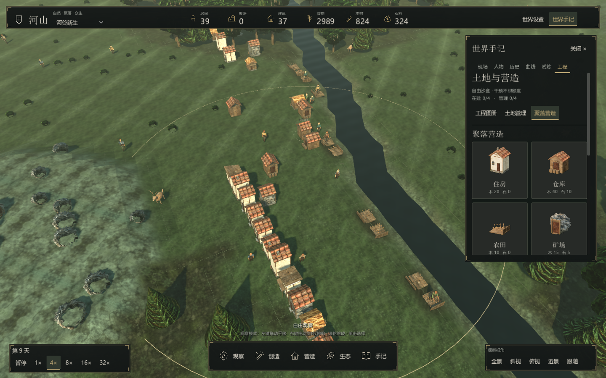

# 聚落营造与鼠标镜头

现在可以在工程页选择“聚落营造”，指定真实建筑的落点，或选一种聚落蓝图作为自由沙盒的经营目标。

## 用鼠标观察世界

| 操作 | 作用 |
|---|---|
| 观察模式左键单击 | 选择人物、建筑或地块 |
| 观察模式左键拖动 | 平移地图；超过六像素后进入拖动，不执行选择或落点 |
| 右键拖动 | 水平旋转与上下俯仰 |
| 滚轮 | 放大、缩小 |
| 中键拖动 | 在任何工具模式下平移 |
| 使用地形、生命或干预工具时左键拖动 | 连续施加当前工具 |
| Esc | 回到观察，取消未确认的工程、建筑或蓝图落点 |

放置建筑或蓝图时也可以左键拖动平移，松开鼠标不会误建。拖动越过手记后仍能松开停止，切到其他窗口会解除拖动。镜头移动不再绑定方向键、WASD 或 Q/E。空间键暂停、F 全景和底部视角按钮仍可使用。

## 不同的房子与聚落布局

住房使用五种体量组合：木屋、灰泥小屋、石屋、高檐屋和斜顶带棚小屋。屋身宽深、高度、门窗、烟囱和檐棚由世界种子与地块位置确定；同一位置载入后保留外观。房屋外观不会改变床位或造价。

房屋优先朝向相邻道路，其次朝向开放地块。仓库有宽门与堆货，矿场有支架与洞口，农田有作物与边缘围栏；施工阶段显示基础和木框，而不是提前显示完工建筑。

新建图形世界默认开启“自然住房布局”。居民在附近候选位置中考虑建筑拥挤、道路和位置差异，不再总挑扫描顺序里的第一个空地。它仍受水源、材料、占用和地形规则约束。这个选项可在世界设置中切换，会影响之后的居民选址，已经建好的房屋保留。旧存档没有这个配置时沿用原来的选址方式；命令行场景默认也沿用原方式。

## 你决定落点，材料支付建造

打开“工程 → 聚落营造”，选择住房、仓库、农田或矿场，单击地图安排工地。成功后可以继续单击安排，Esc 结束。

| 建筑 | 材料 | 落点与用途 |
|---|---|---|
| 住房 | 木材 20 | 水域六格以内的适用平地；完工提供两张床位 |
| 仓库 | 木材 40、石料 10 | 适用平地；完工连接共享库存 |
| 农田 | 木材 10 | 邻接水域的草地；完工后需要农民劳动才能生产 |
| 矿场 | 木材 15、石料 5 | 可建造山地；仍依赖居民采矿劳动 |

八格内需要能到达工地的成年居民。材料依次来自该居民背包、工地附近仓库、工地附近地面物资堆，与自主建造使用同一条扣料与施工规则。委托不赠送材料、不瞬间完工、不强制居民搬入。位置、通行、材料或容量不满足时不给工地，也不扣材料。

在进行中的世界试炼中，成功委托另外消耗 15 点额度；失败不会扣额度。自由沙盒不限制委托额度，但仍需要建筑材料。

## 三种可选经营蓝图

选择一个蓝图，然后在地图上单击中心。铜色细圈标出半径十格的观察区。计数来自圈内实际居民、完工建筑、道路与未燃烧森林。

| 蓝图 | 目标 | 一种可尝试的组合 |
|---|---|---|
| 河畔农庄 | 住房 2、仓库 1、农田 2、居民 6 | 先留水边农田位置，再建住房和仓库，外围湿地修复稳定水土 |
| 林间驿站 | 住房 2、仓库 1、森林 12 格、道路 8 格、居民 6 | 留出通道，外围恢复森林，观察木材供给与可达性 |
| 集市小镇 | 住房 3、仓库 2、农田 1、道路 12 格、居民 10 | 两处仓库与道路联通资源区，逐步增加床位，观察人口是否留下 |

目标需要在连续两个游戏日界满足。单纯等待几个显示帧不会积累进度，条件失去会清零；已达成的蓝图保留完成标记，当前数值仍会变化。暂停时可以观察和规划，恢复时间才能积累稳定天数。

蓝图是自选目标，不会强制产生贸易、驿站职业或新的文明等级，也没有自动发放资源奖励。可以随时停止或更换目标，已有地形与建筑保留。保存、载入与回溯会保留蓝图中心、类型和稳定进度。

## 组合经营的一局

1. 暂停世界，在水源附近找有居民且道路可达的区域，开始“河畔农庄”。
2. 用道路留出通行线，给两块邻水草地保留农田位置；不要把它们铺成道路。
3. 查看居民背包和仓库，确保有材料，再委托住房、仓库和农田。
4. 恢复时间。观察施工、农民劳动、粮食与居民需求；有房屋不等于居民一定住进来。
5. 在外围安排湿地修复和林地复苏，补充水土与木材；根据生态条件选择维护或自然演替。
6. 蓝图完成后改尝试林间驿站或集市小镇，观察道路、资源分布和人口如何影响聚落。

工程配方扩展见 [生态工坊](ecology.md)，源码与存档边界见 [开发指南](../development/architecture.md)。
