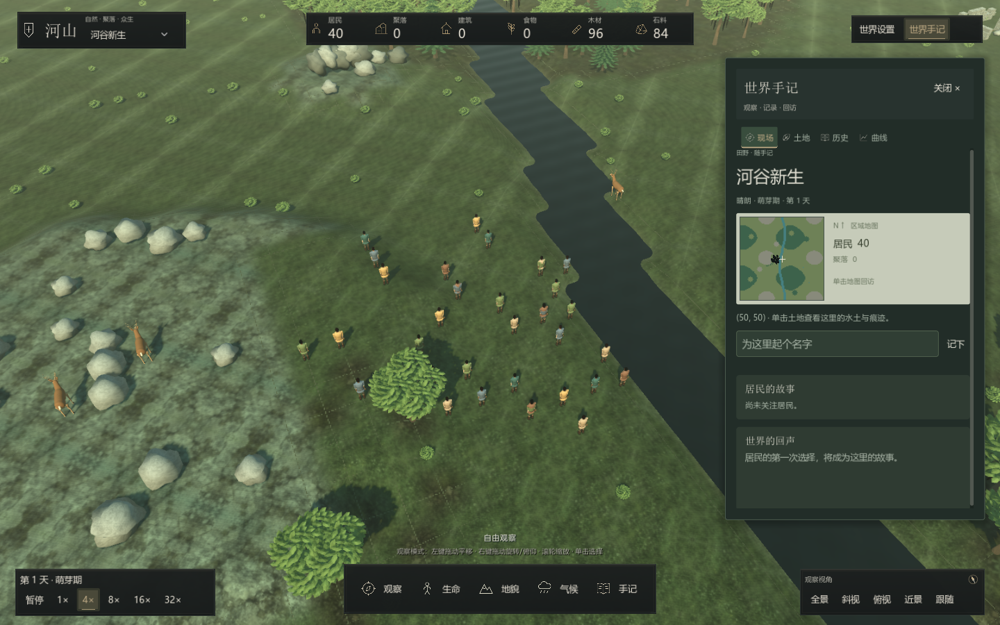
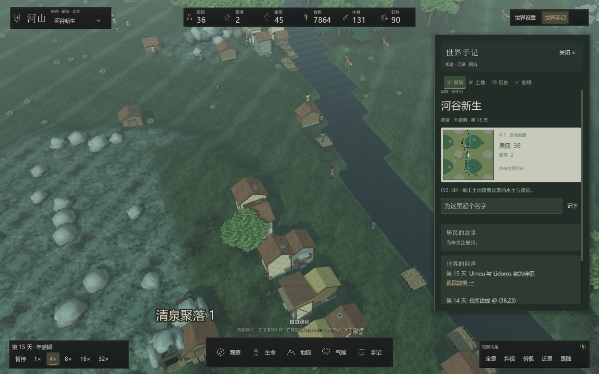

# 地形与居民留下的痕迹

地形使用共享顶点的细分曲面和平滑法线，河床与水面沿连续的岸线权重衔接。格子仍是模拟的空间单位，细分、微起伏和岸线过渡属于表现层；不把每个显示顶点变成一个模拟格子。

## 土地如何逐渐改变

居民实际跨到下一格时，该格累积少量 `FootTraffic`（土壤压实）。采木、采矿等作业接触也会少量累积，商队行走压力略高。普通行走每次增加当前剩余空间的 0.15%，不是走过一次就造出一条路；没有人数门槛或任务进度。反复使用的区域逐渐变暗、植被受损，地面产生轻微下陷。

压实也会减慢该格的资源再生和自然植被恢复，因此是实际生态状态，不只是脚印贴花。它不会自动把地形改成正式道路。水域、不可行走土地、铺装道路和建筑占地受到保护。

停止使用后，压实每个游戏小时保留原值的 99.6%；约 173 游戏小时下降一半。对应的微小下陷随压实缓解恢复，植被继续由原有水土、生长与火灾规则决定。改变地形会清除原有压实，既有收获、火灾或植被损耗不会被一并撤销。

300 次连续普通经过、期间不计恢复时，压实约为 36%。这只是说明累积速度；实际世界中不同路线、人数、作业和空闲时间会形成不同结果。玩家可以观察聚落周边、资源采集地和往返取水路线，查看长期活动如何留下痕迹。

## 观察与保存

世界手记会在被明显踩踏的选中土地旁显示压实信息。核心存档 v4 保存逐格压实、海拔和植被，并纳入确定性摘要；载入 v3 存档时缺失压实默认零，从载入后的实际活动开始积累，不推测过去的行走历史。

在线 `/v1/sessions/{id}/map` 增加 `elevation`、`footTraffic`、`vegetation`。`elevation` 是实际归一化海拔；旧的 `traversalHeight` 仍保留原有寻路温度代理语义。读取地图不会推进游戏时间。

## 表现与性能

每格显示为 3×3 个小四边形，共享相邻顶点并计算平滑法线。坡面有稳定、低幅度的微起伏；河岸采用邻域平滑的水域权重，水面在陆地一侧裁切，并下挖水域河床，使水面不被高出的床面遮住。人物定位采样当前三角面，并加入压实下陷。

踩踏纹理与微小下陷通过共享贴图更新，压实变化不逐步重建整张地形；地形工具、海拔变化和观察图层仍触发正式网格更新。视觉刷新使用分级显示精度，模拟中的压实值仍按每次实际接触连续保存。

同一种子自由运行 14 个游戏日后的世界：

