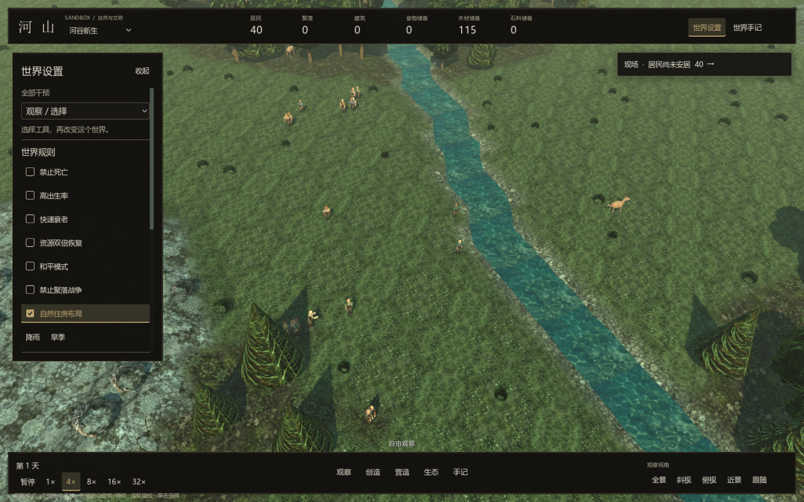

# 河山 · 玩家手册

## 从一片土地开始
Windows 已配置环境时双击根目录 Play-3D.cmd。第一次进入先暂停，点击右上方现场提醒或“世界手记”，在“现场”页看小地图和风险卡。点击定位会把镜头带到问题发生的位置；选择救助工具后，需要在地图上亲自施加干预。

点击一个居民查看需求、行为、库存与人生记录。可以给他改名并关注他，再以 4 倍或 8 倍速观察几天。食物紧缺时可立即投放食物，也可以安排食物绿洲工程，观察居民是否搬过去、能否维持生活。工程不会立即完工，需要经历三次日界。自由沙盒允许反复试验；想增加压力时开启有限额度的世界试炼。

## 镜头与时间
| 操作 | 用途 |
|---|---|
| 滚轮 | 放大、缩小 |
| 观察模式左键拖动 | 平移地图，松开不执行选择或落点 |
| 鼠标右键拖动 | 旋转视角与调整俯仰 |
| 鼠标中键拖动 | 任意工具模式下平移 |
| F | 镜头居中；人物跟随通过镜头按钮选择 |
| 空格 | 暂停 / 恢复 |
| 时间按钮 | 1、4、8、16、32 倍速 |
| Esc | 取消当前工程落点或工具 |
| 左键 | 选择对象、使用工具或确认工程位置 |

一天为 1440 tick，基础速度为每秒 10 tick；8 倍速理论上约 18 秒一天，实际受机器性能影响。暂停时仍可查看、移动镜头和安排工程。

镜头不再使用方向键、WASD 或 Q/E。左键单击仍用于选择或确认，使用干预工具时左键拖动继续施加工具。建造委托与三种聚落蓝图见 [聚落营造](settlements.md)。

## 世界手记
六个页签分别是现场、人物、历史、曲线、试炼、工程。默认收起手记以保留世界视野，现场提醒显示优先风险。现场页按火灾、疾病、饥饿、口渴、住房的顺序显示最多三张风险卡。风险来自真实状态，不会为了制造热闹凭空触发。

小地图使用当前地图的实际宽高比例，点击即可定位。浅色点是居民，橙色表示火情，薄荷色圆圈是进行中的工程，金色圆圈表示关注的人物。地形底图约每秒更新一次。选择、定位和观察不会推进世界，也不会改变随机数。

人物关注使用稳定身份编号，存读档后继续有效。人物去世后保留其档案。名称最多 24 个字符；改名会记录事件，以前的历史文字保留当时的名字。

人物页提供独立的 3D 肖像。拖动肖像旋转人物，滚轮拉近或拉远；不会移动世界镜头。肖像展示当前居民的体型、服装与职业配件。

人物页顶部显示生命、饥饿、干渴和精力状态条。饥饿、干渴越高，压力越大；生命、精力越低，越需要留意。危险值用铁锈色提示，下方仍可查看当前行动、物资与关系。

## 操作菜单
底部“创造”展开分类工具；“营造”和“生态”分别打开聚落建造与土地工程，“手记”打开观察面板。选择“观察”或按 Esc 收起创造工具并返回选择模式。顶部资源栏只统计已采集储备，不能当作每个居民的可用库存。

## 创建条件
河谷、两岸、绿洲、荒野场景提供不同地形与起始条件，居民仍由模拟自主行动。工具栏提供以下干预：
| 工具 | 实际作用 |
|---|---|
| 检查 | 选择地块、人物和建筑 |
| 人类、动物、狼 | 在允许的位置生成个体 |
| 森林 | 种植林地 |
| 食物、木材、石材、铁矿 | 增加地表资源，受地块容量约束 |
| 草地、水域、山地、沙地、雪地、湿地、沙漠、熔岩 | 改变地形 |
| 农田、道路 | 改变地块类型；农田地形不等于居民建造的农业建筑 |
| 升高、降低 | 改变地形高度 |
| 河流、移除水域 | 调整水域分布 |
| 肥力 | 调整土壤条件 |
| 出生祝福 | 改变全局高出生规则 |
| 治愈 | 恢复健康并治疗疾病 |
| 丰产 | 促进资源恢复 |
| 降雨 | 提高湿度；足够强度可扑灭尚未烧尽的火 |
| 火焰、闪电 | 引燃或伤害 |
| 洪水 | 淹没地形并破坏建筑 |
| 干旱 | 降低湿度 |
| 瘟疫 | 施加疾病；免疫等真实条件仍生效 |
| 陨石 | 伤害、破坏建筑并改变地表 |

道路不会自动盖房，湿润土壤也不等于居民已有饮水来源。资源、可达性和住房需求会共同决定居民的选择。

## 土地工程与长期经营
打开工程页的“工程图册”，选一个计划，再在左侧选择半径 3、5、8；默认费用分别为 30、34、40 点。移动鼠标检查范围，左键确认。自由沙盒不限制额度。最多同时建设四项、管理四片土地，保留最近十二条记录。没有合适土地或已达上限会拒绝放置，不扣额度。

| 工程 | 三次日界发生的变化 |
|---|---|
| 食物绿洲 | 改善肥力与草地条件，随后补充地表食物，最后局部降雨 |
| 防火走廊 | 分三段清理横向三格宽走廊的植被、资源和火情，形成道路 |
| 湿地修复 | 连续改善适用地块的湿度和肥力 |
| 林地复苏 | 分三圈恢复适用土地上的森林；不会覆盖正在燃烧的地块 |
| 迁徙通道 | 分段建立斜向小径，清理燃料与资源 |
| 林粮镶嵌 | 分区建立林地和粮地，再局部降雨 |

完成后，在“土地管理”中选择自然、维护或采集。自然停止额外管理；维护按配方持续改善适用地块；采集优先补充地表资源，并可能消耗土壤和植被。试炼中维护会花费每日额度，条件或额度不足时暂停。完工对照保持冻结，卡片上的当前数值继续变化。

组合策略与新增配方的方法见 [生态工坊](ecology.md)。例如先用湿地改善水分，再维护适用粮地，之后比较资源优先与自然演替的后果。

工程保护已有建筑、水域、山地和熔岩等不适用地块；食物绿洲避开森林和道路，林地复苏避开道路。天气、采集和灾害仍会作用于工程区域。取消会停止未来阶段，已生效的变化保留，试炼额度不退款。

报告冻结安排前与结束时的局部数据：地表食物、燃烧格数、平均湿度、植被及当地居民需求。食物统计不包含背包和仓库；居民可能迁入或迁出。这是实际前后对照，不能单独证明变化全部由工程造成。

## 有限额度的挑战
三种试炼分别关注旱季、火情、疫病。初始额度 120，上限 200，每天恢复 8；全局天气干预有额外成本。第 4、7 天会出现预设危机。从第 8 天开始，原始居民存活至少 80%、饥饿比例不超过 25%、住房比例至少 30%，疫病试炼还要求患病比例不超过 10%，连续满足两天可通过。第 14 天仍未达成则结束。新造居民不会补回初始居民的存活成绩。

通过与否冻结为结果，世界可以继续运行。试炼面板显示目标阈值、预算、持续天数和结果。

## 保存和回溯
客户端存档同时包含内核、场景、试炼、工程和关注人物。读取旧档时缺失的客户端功能恢复为空状态。回溯快照避免递归包含自身；新世界会清除旧工程和关注对象。Console 只运行内核，不推进图形客户端的工程与试炼会话。

世界设置位于顶部右侧，其中包含世界规则、观察图层、随机种子、保存与载入以及实验起点。列表可以向下滚动。

热力图用于看资源、湿度、肥力、危险等分布，曲线用于比较日间趋势；实际住址和物资仍应在人物或建筑检查器中确认。

## 运行与表现
项目通过 Godot .NET 和启动脚本运行，安装方式见 [安装与启动](getting-started.md)。地形、建筑与部分细节使用程序生成表现。世界系统与策略见 [世界如何运转](world-systems.md)，开发与内容扩展见 [开发指南](architecture.md)。
